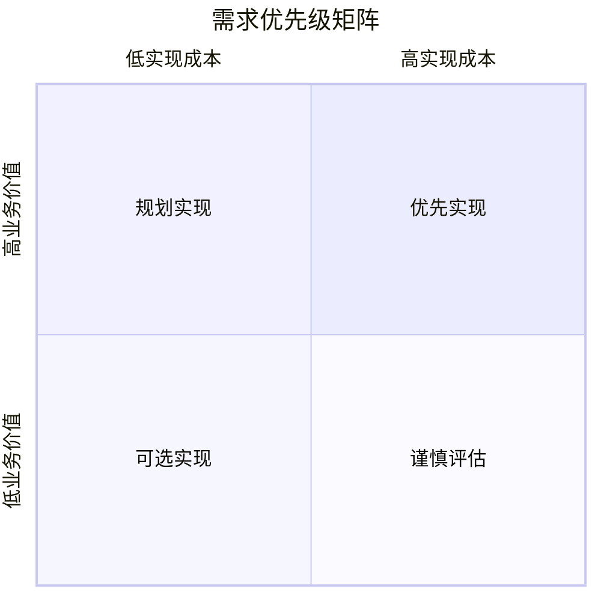
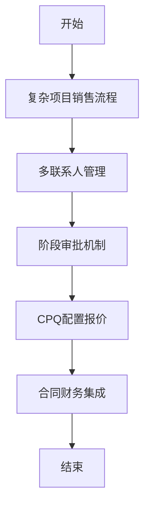
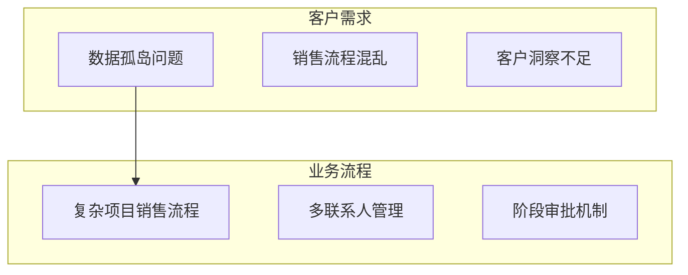
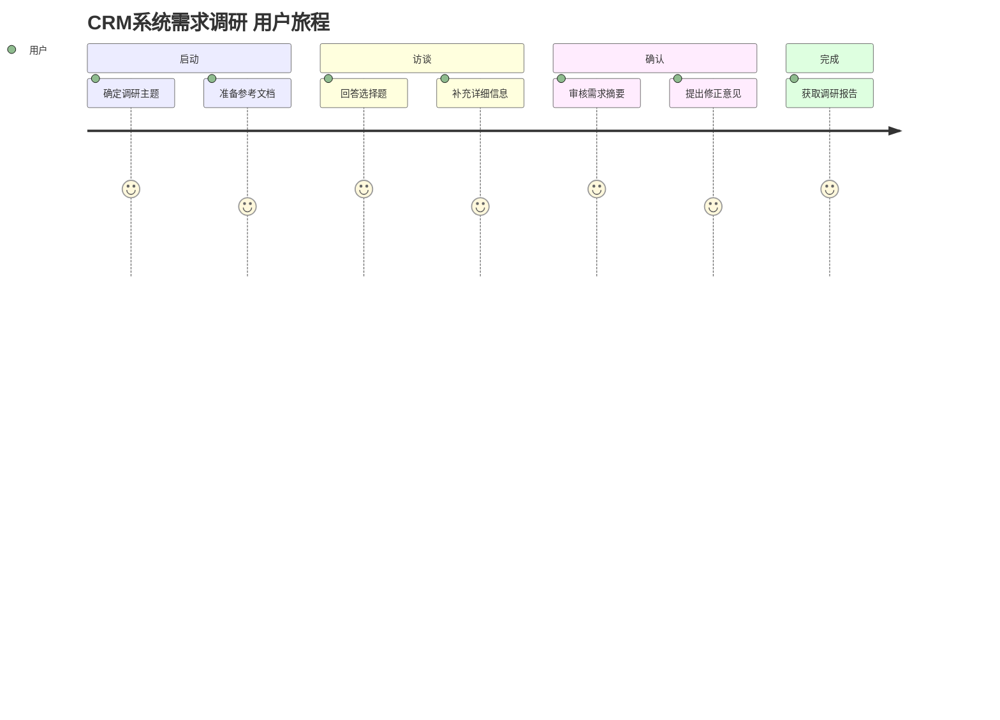
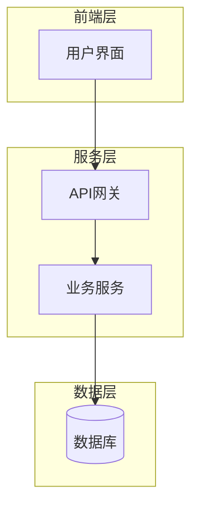

# CRM系统需求调研 需求调研报告

**调研日期**: 2026-01-20 14:38
**调研场景**: 新客户需求调研
**报告编号**: deep-vision-20260120-crm系统需求调研

---

## 1. 调研概述

### 1.1 基本信息

| 项目 | 内容 |
|-----|------|
| 调研主题 | CRM系统需求调研 |
| 调研场景 | 新客户需求调研 |
| 调研时长 | 约30分钟 |
| 完成维度 | 4/4 (客户需求, 业务流程, 技术约束, 项目约束) |

### 1.2 参考文档

*待补充*

---

## 2. 需求摘要

### 2.1 核心需求列表

### 2.2 优先级矩阵

---

## 3. 详细需求分析

### 3.1 客户/用户需求

#### 核心痛点

#### 期望价值

#### 使用场景

#### 用户角色

### 3.2 业务流程

#### 关键流程

#### 流程图

### 3.3 技术约束

#### 现有技术栈

#### 集成接口要求

#### 性能指标
| 指标 | 要求 | 说明 |
|-----|-----|-----|

#### 安全合规

### 3.4 项目约束

#### 预算范围
*待确认*

#### 时间节点
| 里程碑 | 日期 | 交付物 |
|-------|-----|-------|

#### 资源限制

#### 其他约束

---

## 4. 可视化分析

### 4.1 需求关联图

### 4.2 用户旅程图

### 4.3 系统架构图

---

## 5. 竞品对比

*待补充*

---

## 6. 实现建议

### 6.1 技术方案建议

### 6.2 实施路径建议

---

## 7. 风险评估

| 风险项 | 可能性 | 影响程度 | 应对策略 |
|-------|-------|---------|---------|

---

## 8. 附录

### 8.1 完整访谈记录

点击展开完整访谈记录

**Q1**: 调研场景
**A1**: 新客户需求调研
*维度: 基础信息*

**Q2**: 核心痛点
**A2**: 数据孤岛、销售流程混乱、客户洞察不足、报表统计困难
*维度: customer_needs*

**Q3**: 核心期望
**A3**: 智能分析决策
*维度: customer_needs*

**Q4**: 用户角色
**A4**: 销售代表、销售经理、市场营销、客服人员
*维度: customer_needs*

**Q5**: 销售流程类型
**A5**: 复杂项目销售流程
*维度: business_process*

**Q6**: 关键环节
**A6**: 多联系人管理、阶段审批机制、CPQ配置报价、合同财务集成
*维度: business_process*

**Q7**: 技术架构偏好
**A7**: 混合云架构
*维度: tech_constraints*

**Q8**: 集成需求
**A8**: ERP、即时通讯、邮件营销、BI分析集成
*维度: tech_constraints*

**Q9**: 并发性能
**A9**: 高并发（1000+用户）
*维度: tech_constraints*

**Q10**: 安全合规
**A10**: 等保合规、数据本地化、审计追溯、SSO单点登录
*维度: tech_constraints*

**Q11**: 预算范围
**A11**: 500万以上
*维度: project_constraints*

**Q12**: 上线时间
**A12**: 3个月内
*维度: project_constraints*

### 8.2 术语表

| 术语 | 定义 |
|-----|-----|

---

## 文档信息

- **生成工具**: Deep-Vision 智能需求调研技能
- **生成日期**: 2026-01-20 14:38
- **版本**: v1.0

---

*此报告由 Deep-Vision 智能需求调研技能自动生成，内容严格基于访谈收集的信息*
