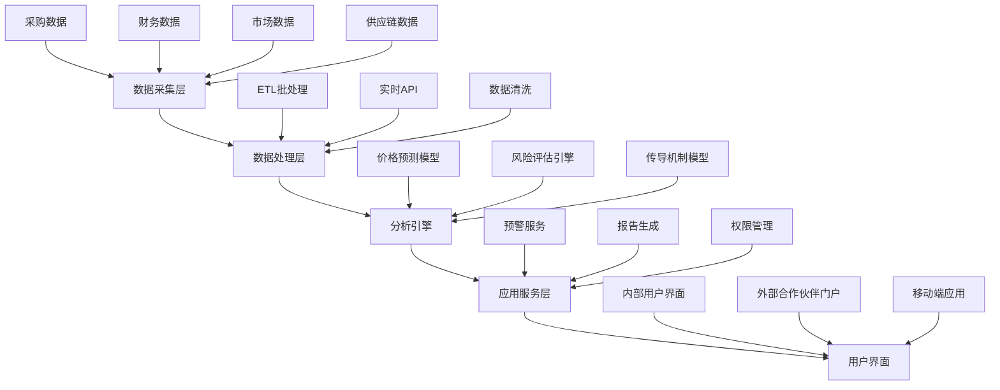
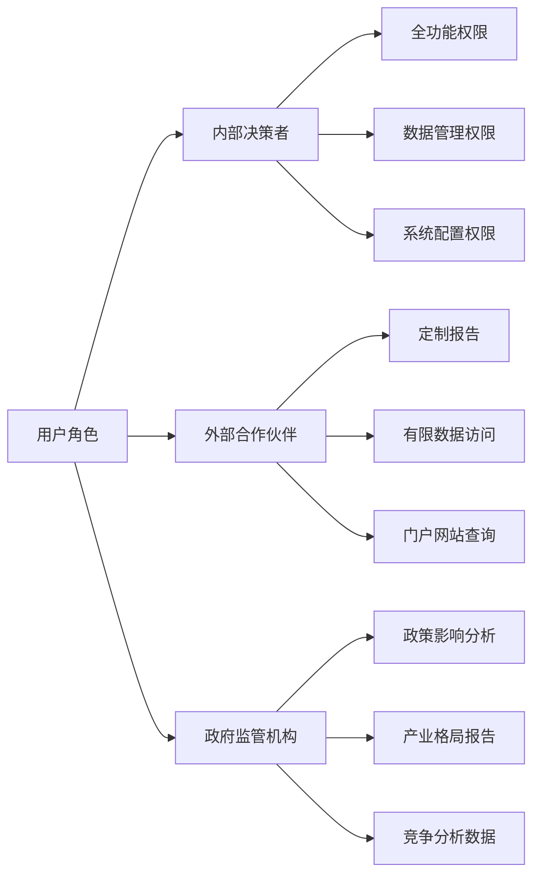
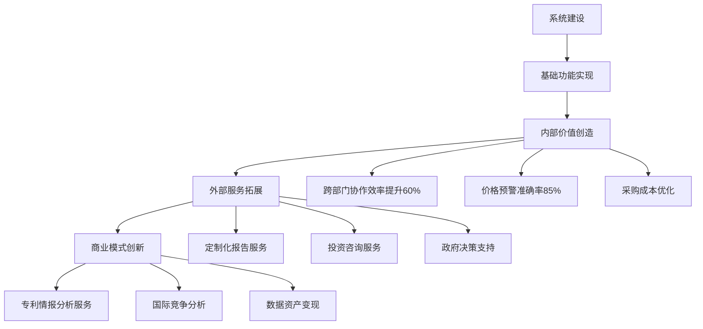

# 新能源行业趋势分析系统需求调研报告

## 1. 调研概述

### 1.1 基本信息
- **调研主题**: 新能源行业趋势分析调研
- **调研时间**: [基于访谈记录整理]
- **调研对象**: 新能源企业业务决策者
- **调研方法**: 深度结构化访谈
- **报告撰写**: 专业需求分析师

### 1.2 调研背景
在新能源产业快速发展的背景下，企业面临产业链信息不透明、供需匹配效率低等挑战。本次调研旨在深入了解新能源行业趋势分析的具体需求，为构建专业的趋势分析系统提供决策依据。

## 2. 需求摘要

### 2.1 核心需求列表
1. **价格波动预测系统** - 上游原材料（锂矿、硅料）价格预测
2. **价格传导机制模型** - 成本变化对下游产品定价影响评估
3. **多用户角色系统** - 内部决策者与外部合作伙伴访问
4. **动态权限管理** - 基于项目状态的实时权限调整
5. **跨部门协作平台** - 提升数据整合效率60%
6. **风险预警系统** - 价格波动预警准确率达85%以上

### 2.2 优先级矩阵

| 需求类别 | 重要性 | 紧急性 | 优先级 |
|---------|--------|--------|--------|
| 价格波动预测 | 高 | 高 | P0 |
| 跨部门协作 | 高 | 高 | P0 |
| 权限管理 | 高 | 中 | P1 |
| 风险预警 | 中 | 高 | P1 |
| 外部服务 | 中 | 低 | P2 |

## 3. 详细需求分析

### 3.1 客户/用户需求

#### 3.1.1 核心痛点
- **信息不透明**: 产业链上下游信息获取困难
- **匹配效率低**: 供需匹配效率亟待提升
- **决策时间窗口短**: 投资决策周期紧张，无法等待深度分析完成
- **协作成本高**: 跨部门数据收集整合时间冗长

#### 3.1.2 期望价值
- **成本控制**: 建立价格传导机制模型，优化采购决策
- **风险管控**: 建立全面的新能源投资风险识别和控制机制
- **效率提升**: 跨部门协作效率改善，数据收集整合时间减少60%
- **商业拓展**: 基于数据洞察开拓新的收入来源或合作模式

#### 3.1.3 应用场景
- **采购决策**: 上游原材料价格波动预测和采购时机判断
- **成本分析**: 原材料成本变化对下游产品定价影响评估
- **风险预警**: 供应链事件监测和主动预警推送
- **投资咨询**: 基于专利布局分析指导技术投资方向

#### 3.1.4 用户角色
- **内部决策者**: 业务决策、成本控制、风险管理
- **外部合作伙伴**: 供应商、客户等需要共享部分分析结果
- **政府监管机构**: 产业政策制定和监管决策的数据支撑

### 3.2 业务流程

#### 3.2.1 关键流程节点
**价格传导机制模型建立流程:**
- **数据收集与清洗**: 原材料价格、供需量、库存等关键指标
- **跨部门协作**: 采购部提供采购数据，财务部提供成本数据，技术团队负责整合清洗
- **模型构建**: 建立价格传导关系模型
- **预警输出**: 生成价格波动预警和成本影响分析

#### 3.2.2 异常处理机制
- **数据争议升级机制**: 建立数据争议升级机制，无法协调时上报管理层
- **数据治理委员会**: 成立专门的数据治理委员会处理复杂数据质量问题

### 3.3 技术约束

#### 3.3.1 部署架构
- **混合云架构**: 核心数据本地存储，计算资源云端弹性扩展
- **云原生设计**: 容器化部署和自动化运维减少人力投入

#### 3.3.2 性能要求
- **实时响应**: 价格波动预警需要即时触发（秒级响应）
- **数据处理**: 支持大规模多源数据实时处理和分析

#### 3.3.3 集成接口
- **混合集成方案**: 
  - 批量数据通过ETL处理
  - 实时数据通过API接入
  - 关键预警数据通过消息推送

#### 3.3.4 安全管控
- **动态权限控制**: 基于项目周期和合作状态实时调整访问权限
- **混合审批模式**: 紧急情况自动处理，常规变更走审批流程
- **多重安全防护**: 
  - 外部访问系统的网络安全防护
  - 合作伙伴信息访问权限控制
  - 核心商业机密防护

### 3.4 项目约束

#### 3.4.1 预算约束
- **总预算**: 100万以内
- **实施策略**: 基础功能优先，分阶段实施

#### 3.4.2 时间约束
- **快速上线**: 3个月快速上线核心功能
- **迭代完善**: 边用边完善，持续优化

#### 3.4.3 资源约束
- **技术人员**: 内部技术团队人员不足，需要外包部分开发工作
- **专业人才**: 缺乏新能源行业专业分析师，需要外聘顾问
- **协调资源**: 跨部门协调人员配置不足，影响数据对接效率

## 4. 可视化分析

### 4.1 系统架构图

### 4.2 用户角色权限图

### 4.3 业务价值实现路径

## 5. 方案建议

### 5.1 技术架构建议
1. **采用微服务架构**: 支持快速迭代和功能扩展
2. **实施云原生部署**: 降低运维成本和技术债务
3. **建立数据湖架构**: 支持多源异构数据统一管理
4. **引入AI/ML能力**: 提升价格预测和风险识别准确性

### 5.2 实施路线建议
**第一阶段（1-3个月）**: 核心功能MVP
- 基础数据收集和清洗功能
- 价格波动预警系统
- 简化版权限管理

**第二阶段（4-6个月）**: 功能完善
- 完整的跨部门协作平台
- 外部合作伙伴门户
- 高级分析功能

**第三阶段（7-12个月）**: 商业化拓展
- 对外咨询服务能力
- 专利情报分析
- 政府服务模块

### 5.3 组织保障建议
1. **成立项目管理办公室**: 统筹跨部门协调
2. **建立数据治理委员会**: 确保数据质量和安全
3. **引入外部专家**: 补充行业知识和技术能力
4. **制定培训计划**: 提升团队数据分析能力

## 6. 风险评估

### 6.1 技术风险
| 风险项 | 风险等级 | 影响 | 应对策略 |
|--------|----------|------|----------|
| 系统维护成本超预期 | 高 | 长期运营困难 | 云原生架构，自动化运维 |
| 数据集成复杂度高 | 中 | 开发周期延长 | 分阶段实施，优先核心集成 |
| 实时性能要求难实现 | 中 | 用户体验下降 | 采用流处理技术，缓存优化 |

### 6.2 业务风险
| 风险项 | 风险等级 | 影响 | 应对策略 |
|--------|----------|------|----------|
| 数据安全泄露 | 高 | 商业机密损失 | 多层级权限控制，审计日志 |
| 跨部门协作阻力 | 中 | 功能价值受限 | 建立激励机制，管理层推动 |
| 预测准确率不达标 | 中 | 业务价值质疑 | 持续模型优化，人工智能辅助 |

### 6.3 项目风险
| 风险项 | 风险等级 | 影响 | 应对策略 |
|--------|----------|------|----------|
| 人力资源不足 | 高 | 项目延期 | 外包合作，分阶段交付 |
| 预算超支 | 中 | 功能缩减 | 严格成本控制，优先级管理 |
| 需求变更频繁 | 中 | 开发混乱 | 敏捷开发，版本控制 |

## 7. 下一步行动

### 7.1 立即行动项（1-2周）
1. **成立项目团队**: 确定项目经理和核心团队成员
2. **制定详细预算**: 细化100万预算的分配方案
3. **选择技术合作伙伴**: 启动外包服务商选择流程
4. **数据盘点**: 清点现有数据资源和质量状况

### 7.2 短期行动项（1个月）
1. **完成技术方案设计**: 确定混合云架构具体实施方案
2. **建立数据治理机制**: 制定数据质量标准和争议处理流程
3. **启动核心功能开发**: 优先开发价格预警和数据集成功能
4. **制定安全策略**: 完成权限管理和数据安全方案设计

### 7.3 中期行动项（3个月）
1. **完成MVP上线**: 核心功能测试和部署上线
2. **用户培训**: 开展系统使用培训和业务流程优化
3. **效果评估**: 建立成功指标监测机制
4. **第二阶段规划**: 制定功能扩展和商业化路线图

### 7.4 长期行动项（6-12个月）
1. **外部服务拓展**: 开发合作伙伴门户和咨询服务能力
2. **AI能力引入**: 集成机器学习和人工智能技术
3. **商业模式创新**: 探索