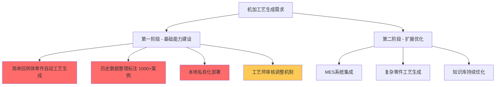
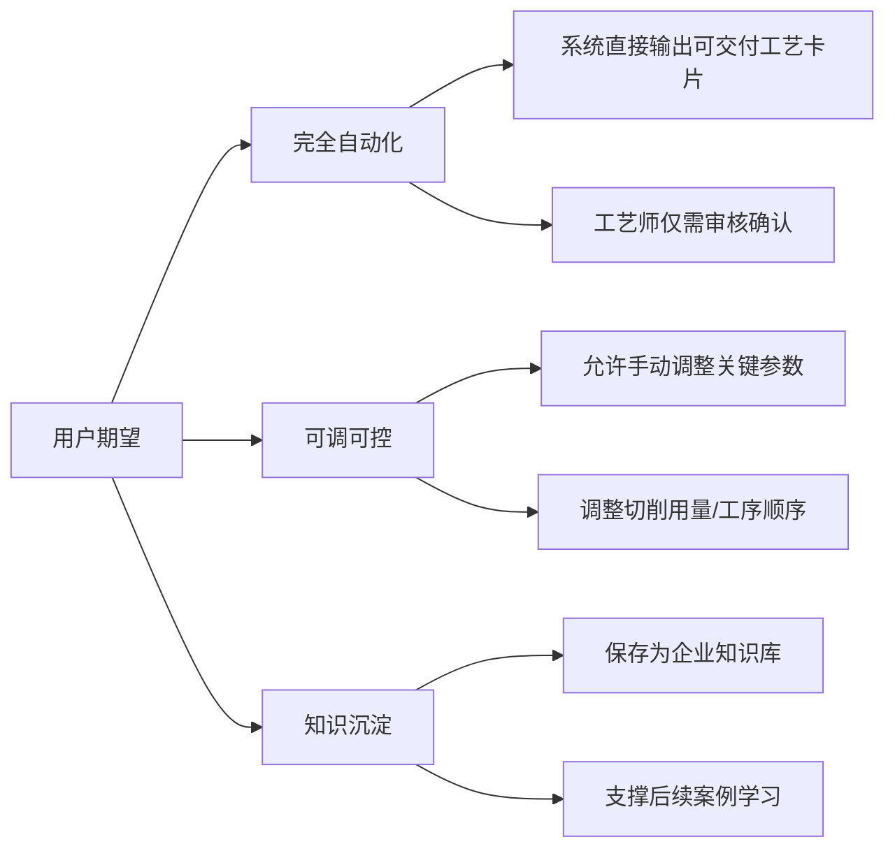
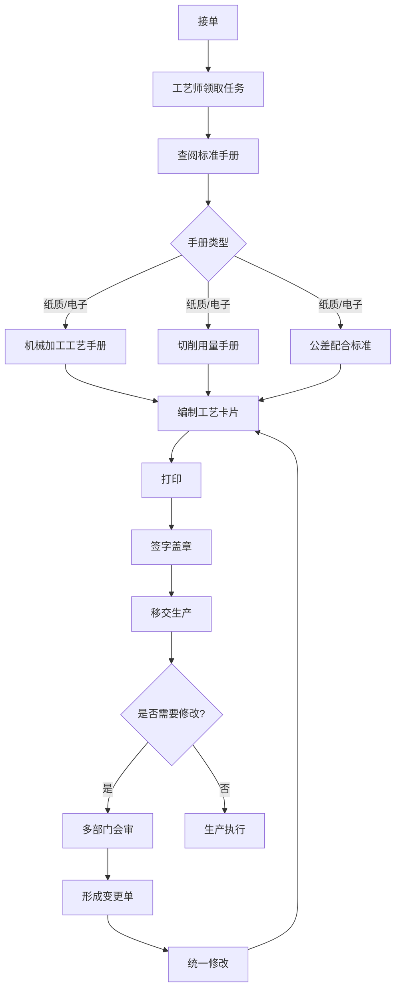
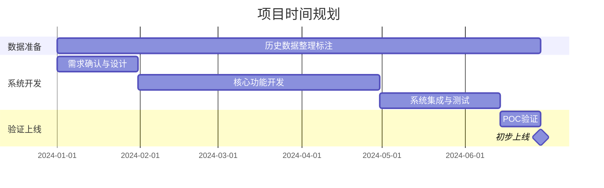
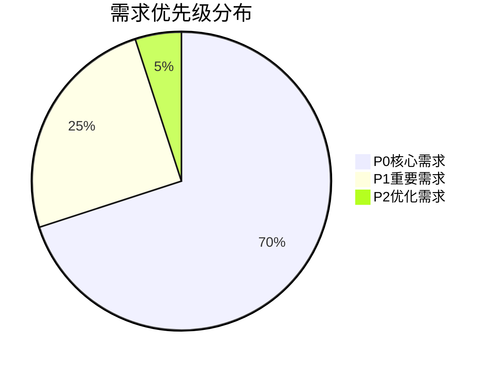
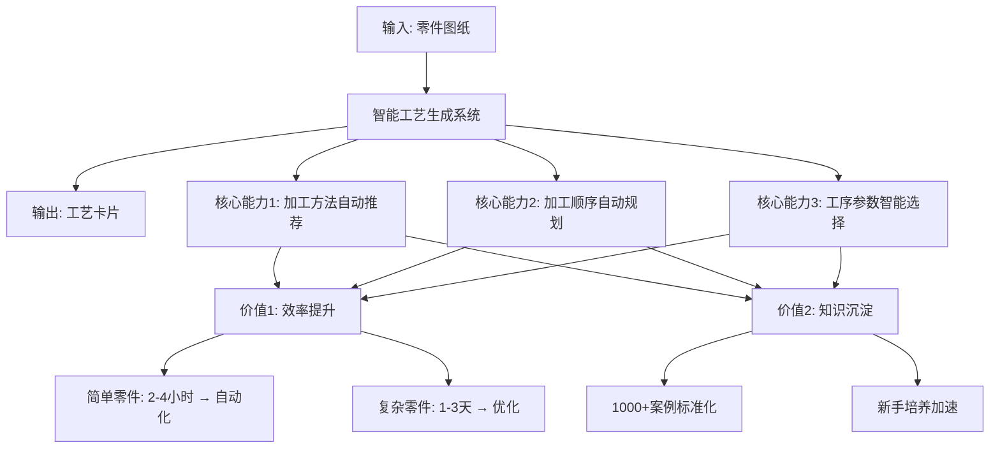
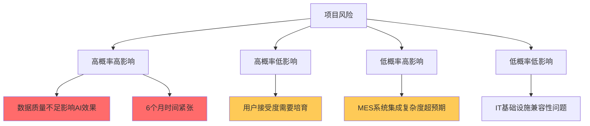

# 机加工艺生成系统需求调研报告

## 1. 调研概述

### 1.1 基本信息

| 项目 | 内容 |
|------|------|
| 调研主题 | 机加工艺生成 |
| 调研日期 | 2024年 |
| 调研方式 | 深度访谈 |
| 受访对象 | 工艺部门负责人及业务专家 |
| 报告版本 | V1.0 |

### 1.2 调研背景

本次调研旨在深入了解企业在机加工艺生成工作中的核心痛点、业务流程、技术需求及项目约束，为机加工艺生成系统的建设提供决策依据。通过系统化的访谈,明确了企业在工艺编制效率、知识传承、智能化转型等方面的迫切需求。

## 2. 需求摘要

### 2.1 核心需求列表

| 序号 | 需求类别 | 核心需求 | 优先级 |
|------|---------|---------|--------|
| 1 | 业务需求 | 提升工艺编制效率(简单零件2-4小时→自动化,复杂零件1-3天→优化) | P0 |
| 2 | 业务需求 | 加工方法和加工顺序的自动推荐 | P0 |
| 3 | 业务需求 | 完全自动生成可交付的工艺卡片(工艺师仅需审核) | P0 |
| 4 | 业务需求 | 从简单回转体零件开始,逐步扩展到复杂零件 | P0 |
| 5 | 功能需求 | 允许工艺师手动调整关键参数并保存为企业知识库 | P1 |
| 6 | 数据需求 | 对现有1000+案例进行分类标注和数据整理 | P0 |
| 7 | 技术需求 | 本地私有化部署,保证数据安全 | P0 |
| 8 | 集成需求 | 与MES系统对接,下发工艺文件到车间 | P1 |
| 9 | 项目约束 | 6个月内完成POC验证和初步上线 | P0 |
| 10 | 项目约束 | 预算控制在50-100万(可增加20%以内) | P0 |

### 2.2 优先级矩阵

## 3. 详细需求分析

### 3.1 客户/用户需求

#### 3.1.1 核心痛点

**痛点1: 工艺编制效率低下**
- 简单零件需要2-4小时
- 复杂零件需要1-3天
- 主要耗时在工艺路线规划和工序参数选择

**痛点2: 人力资源瓶颈**
- 经验丰富的工艺师资源紧缺
- 新手培养周期长
- 需要资深工艺师(10年以上经验)进行数据标注,人力成本大

**痛点3: 知识管理挑战**
- 现有1000+案例缺乏零件类型分类标签
- 无法快速筛选出特定类型零件的相关数据
- 历史工艺知识未得到有效沉淀和复用

#### 3.1.2 用户期望

#### 3.1.3 应用场景

**首要场景: 简单回转体零件工艺生成**
- 从最简单的零件类型开始实现自动化
- 循序渐进地提升自动化程度
- 逐步扩展到复杂零件

**使用流程期望:**
1. 系统自动生成工艺方案
2. 工艺师审核并根据需要调整关键参数
3. 调整后的方案保存为企业知识库
4. 持续优化AI模型学习效果

#### 3.1.4 关键角色

| 角色 | 职责 | 参与程度 |
|------|------|---------|
| 资深工艺师(10年以上) | 数据标注、方案审核、质量把关 | 1-2人专职数据整理,3-6个月 |
| 业务专家 | 需求确认、测试验证 | 3-5人全程参与 |
| IT技术人员 | 系统运维、技术支持 | 2人配合 |

### 3.2 业务流程

#### 3.2.1 现有工艺生成流程

#### 3.2.2 流程分析

**关键环节:**
1. **查阅标准手册**: 需要查阅机械加工工艺手册、切削用量手册、公差配合标准等多类文档
2. **编制工艺卡片**: 最耗时环节,需要工艺路线规划和工序参数选择
3. **变更管理**: 多部门会审,形成变更单后统一修改

**流程痛点:**
- 标准手册查阅效率低(纸质/电子文档分散)
- 工艺卡片编制依赖个人经验
- 变更流程涉及多部门,效率较低

### 3.3 技术约束

#### 3.3.1 部署要求

**硬性要求:**
- 本地私有化部署
- 数据完全存储在企业内部服务器
- 保证工艺数据安全性

**基础设施现状:**
- 已有完善的服务器集群和数据库系统
- IT团队可支持常规运维
- 技术兼容性良好

#### 3.3.2 集成需求

**MES系统对接(P1优先级):**
- 需要将工艺文件下发到车间执行层
- 实现工艺数据与生产执行的闭环管理

#### 3.3.3 数据资产现状

**知识库情况:**
- 有系统化的工艺知识库
- 包含1000+标准化工艺模板和典型零件案例
- 数据结构化程度高

**数据挑战:**
- 缺乏明确的零件类型分类标签
- 无法快速筛选出简单回转体相关数据
- 需要进行数据清洗和标注工作

### 3.4 项目约束

#### 3.4.1 预算约束

| 项目 | 约束条件 |
|------|---------|
| 基础预算 | 50-100万 |
| 弹性空间 | 可增加20%以内 |
| 最高预算 | 120万 |

#### 3.4.2 时间约束

**关键时间节点:**
- 项目总周期: 6个月
- 核心要求: **必须按期交付**
- 数据整理周期: 3-6个月(与项目并行)

#### 3.4.3 资源约束

**人力资源投入:**
- 业务专家: 3-5名全程参与需求确认和测试验证
- 资深工艺师: 1-2名专职进行数据清洗和标注
- IT技术人员: 2名配合系统运维

**妥协空间:**
- 预算可适当增加(控制在20%以内)
- 时间不可妥协,必须按期交付
- 功能范围可阶段性实施

## 4. 可视化分析

### 4.1 需求优先级饼图

### 4.2 项目价值链

### 4.3 风险热力图

## 5. 方案建议

### 5.1 总体策略

基于访谈分析,建议采用**"小步快跑,快速验证"**的实施策略:

1. **聚焦简单回转体零件**,快速实现单点突破
2. **数据整理与系统开发并行**,充分利用3-6个月周期
3. **预留人工调整接口**,在自动化与可控性之间取得平衡
4. **建立闭环反馈机制**,持续优化AI模型

### 5.2 分阶段实施建议

#### 第一阶段 (1-3个月): 基础能力建设

**目标**: 完成数据准备和核心功能开发

| 任务 | 责任方 | 交付物 |
|------|--------|--------|
| 历史数据分类标注 | 1-2名资深工艺师 | 简单