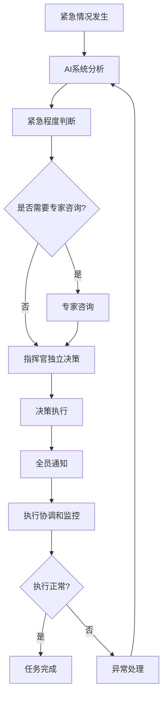
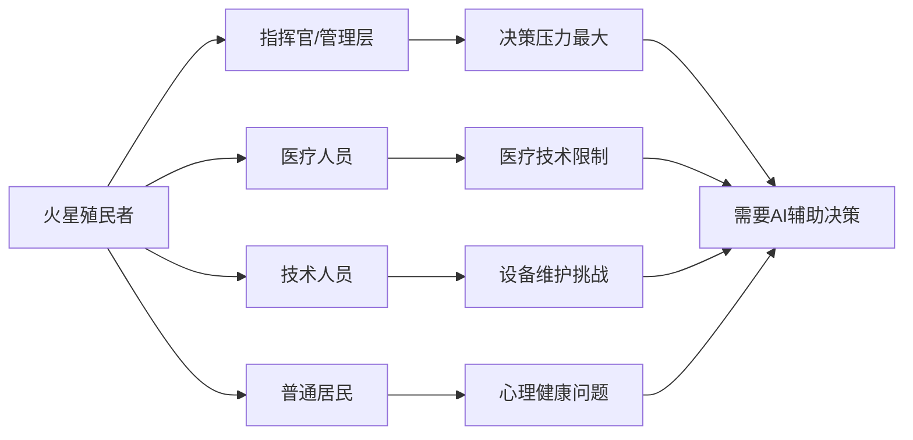
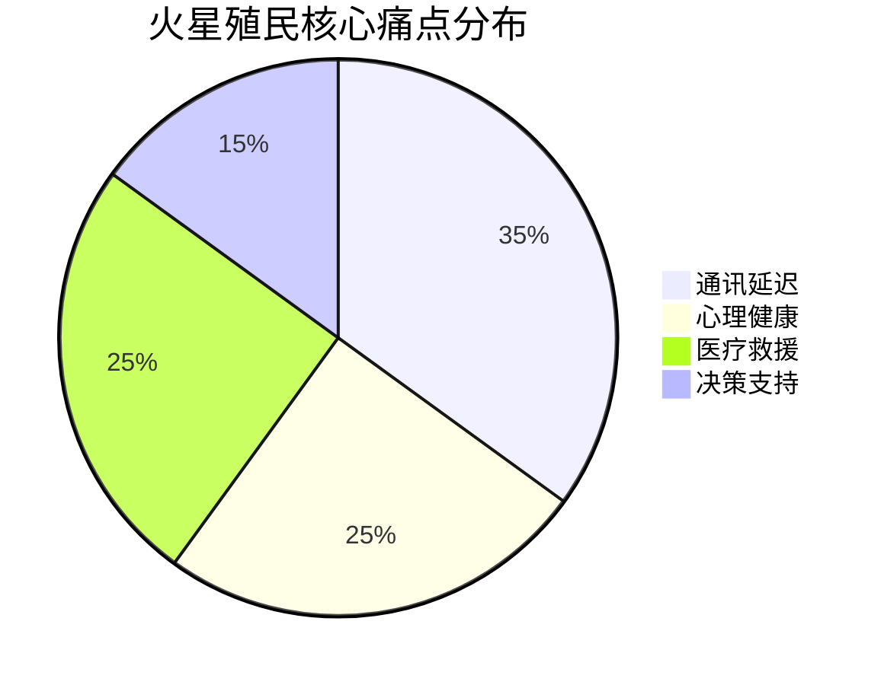

# 火星殖民计划需求调研报告

## 1. 调研概述

### 1.1 基本信息
- **调研主题**：火星殖民计划
- **调研时间**：[调研日期]
- **调研方法**：结构化访谈
- **参考文档**：无

### 1.2 调研背景
火星殖民计划作为人类未来重要的太空探索项目，面临着诸多技术和管理挑战。本次调研旨在识别火星殖民地运营过程中的核心痛点和需求，为后续系统设计和解决方案制定提供依据。

## 2. 需求摘要

### 2.1 核心需求列表
1. **通讯延迟解决方案**：解决与地球通讯延迟导致的紧急支援问题
2. **心理健康支持系统**：应对孤独感、压力和团队冲突问题
3. **医疗救援能力提升**：完善疾病诊断、手术治疗和药品供应
4. **AI辅助决策系统**：支持紧急情况下的快速决策
5. **本地化技术架构**：实现完全独立的火星本地化部署

### 2.2 优先级矩阵

| 需求类别 | 重要性 | 紧急性 | 优先级 |
|---------|--------|--------|--------|
| 通讯延迟解决 | 高 | 高 | P0 |
| AI辅助决策 | 高 | 高 | P0 |
| 医疗救援能力 | 高 | 中 | P1 |
| 心理健康支持 | 中 | 中 | P1 |
| 本地化架构 | 高 | 低 | P2 |

## 3. 详细需求分析

### 3.1 客户/用户需求

#### 3.1.1 核心痛点
- **通讯延迟**：与地球通讯延迟严重，紧急情况下无法及时获得支援
- **心理健康**：孤独感、压力、团队冲突等心理问题
- **医疗能力**：疾病诊断、手术治疗、药品供应等医疗救援能力不足

#### 3.1.2 关键用户角色
- **指挥官/管理层**：承担紧急决策和团队冲突处理责任，压力最大
- **全体殖民者**：均受到心理健康和医疗能力不足问题影响，但具体需求因角色而异

#### 3.1.3 使用场景
- 医疗紧急情况处理
- 设备故障应急响应
- 人员冲突调解
- 日常运营决策支持

### 3.2 业务流程

#### 3.2.1 关键流程节点
**最关键节点**：执行协调和监控阶段
- 确保各角色按计划执行
- 实时跟踪进展
- 处理执行偏差和突发状况

#### 3.2.2 异常处理机制
**推荐机制**：AI辅助决策系统+人工最终确认

#### 3.2.3 标准决策流程
1. 紧急程度判断
2. 专家咨询
3. 指挥官独立决策
4. 全员通知

### 3.3 技术约束

#### 3.3.1 部署架构
**要求**：完全本地化部署
- 所有AI算力在火星本地
- 所有数据存储在火星本地
- 避免依赖地球通讯

#### 3.3.2 技术特点
- 独立性：不依赖外部网络连接
- 可靠性：在极端环境下稳定运行
- 资源优化：适应火星有限的计算和存储资源

### 3.4 项目约束
*该维度暂无收集数据，需要后续补充调研*

## 4. 可视化分析

### 4.1 紧急决策流程图

### 4.2 用户角色影响分析

### 4.3 核心痛点分布

## 5. 方案建议

### 5.1 AI辅助决策系统方案
- **核心功能**：实时分析、紧急程度评估、解决方案推荐
- **部署方式**：完全本地化，独立运行
- **决策流程**：AI建议+人工确认的混合模式

### 5.2 心理健康支持系统
- **监测模块**：实时监控殖民者心理状态
- **干预模块**：提供个性化心理支持和团队冲突调解
- **预警模块**：识别潜在心理健康风险

### 5.3 医疗能力增强方案
- **诊断系统**：AI辅助疾病诊断
- **治疗指导**：手术操作指导系统
- **药品管理**：智能药品配置和供应系统

## 6. 风险评估

### 6.1 技术风险
| 风险项 | 风险等级 | 影响 | 应对策略 |
|--------|---------|------|---------|
| AI系统故障 | 高 | 决策能力丧失 | 建立备用决策流程，人工接管 |
| 本地算力不足 | 中 | 系统性能下降 | 优化算法，分级处理 |
| 数据存储损坏 | 高 | 历史数据丢失 | 多重备份，分布式存储 |

### 6.2 业务风险
| 风险项 | 风险等级 | 影响 | 应对策略 |
|--------|---------|------|---------|
| 指挥官决策错误 | 高 | 生命安全威胁 | 多专家验证，AI二次确认 |
| 团队冲突升级 | 中 | 殖民地运营中断 | 早期预警，快速干预 |
| 医疗紧急情况 | 高 | 人员伤亡 | 完善医疗设备，远程指导 |

## 7. 下一步行动

### 7.1 立即行动项（1-2周）
1. **补充调研**：收集项目约束相关信息（预算、时间、资源）
2. **技术验证**：评估AI本地化部署的技术可行性
3. **原型设计**：设计AI辅助决策系统原型

### 7.2 短期行动项（1-3个月）
1. **系统架构设计**：完成AI辅助决策系统详细架构设计
2. **流程标准化**：制定标准化的紧急决策流程文档
3. **风险评估细化**：完善风险评估和应对预案

### 7.3 长期行动项（3个月以上）
1. **系统开发**：完成AI辅助决策系统开发
2. **集成测试**：进行火星环境模拟测试
3. **培训体系**：建立殖民者使用培训体系

## 8. 附录

### 8.1 完整访谈记录

#### 客户需求访谈
**Q**: 在火星殖民计划中，您认为最核心的痛点是什么？
**A**: 与地球通讯延迟严重，紧急情况下无法及时获得支援

**Q**: 在火星殖民地中，除了通讯延迟问题，您认为还有哪些关键痛点需要优先解决？
**A**: 心理健康问题（孤独感、压力、团队冲突）；医疗救援能力不足（疾病诊断、手术治疗、药品供应）

**Q**: 针对您提到的心理健康和医疗救援问题，在火星殖民地的日常运营中，哪些用户角色或工作岗位最容易受到这些问题的影响？
**A**: 以上都是 — 不同角色面临的具体痛点和需求存在差异；指挥官/管理层 — 因为他们需要做出紧急决策和应对团队冲突

#### 业务流程访谈
**Q**: 在火星殖民地的紧急情况处理流程中，当指挥官需要做出关键决策时（如医疗紧急情况、设备故障、人员冲突），最关键的流程节点是什么？
**A**: 执行协调和监控阶段（确保各角色按计划执行并实时跟踪进展）

**Q**: 在火星殖民地执行协调和监控阶段，当出现执行偏差或突发状况时（如团队成员无法按时完成任务、设备意外故障、资源短缺等），您认为最有效的异常处理机制是什么？
**A**: AI辅助决策系统+人工最终确认

**Q**: 在AI辅助决策系统给出建议后，人工最终确认的标准决策流程应该包括哪些关键步骤？
**A**: 紧急程度判断→专家咨询→指挥官独立决策→全员通知

#### 技术约束访谈
**Q**: 考虑到火星殖民地的特殊环境和资源限制，AI辅助决策系统的部署架构应该采用什么模式？
**A**: 完全本地化部署（所有AI算力和数据存储在火星本地，避免依赖地球通讯）

---

*报告生成时间：[当前日期]*
*报告版本：V1.0*