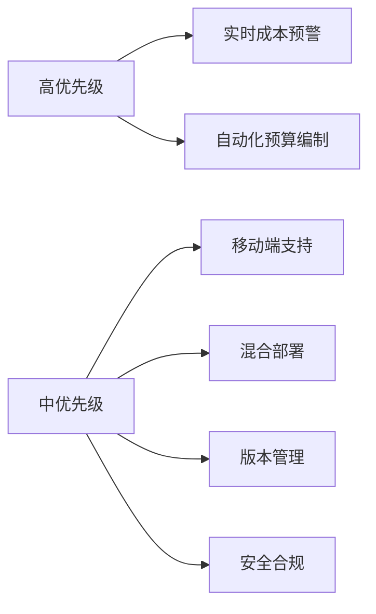
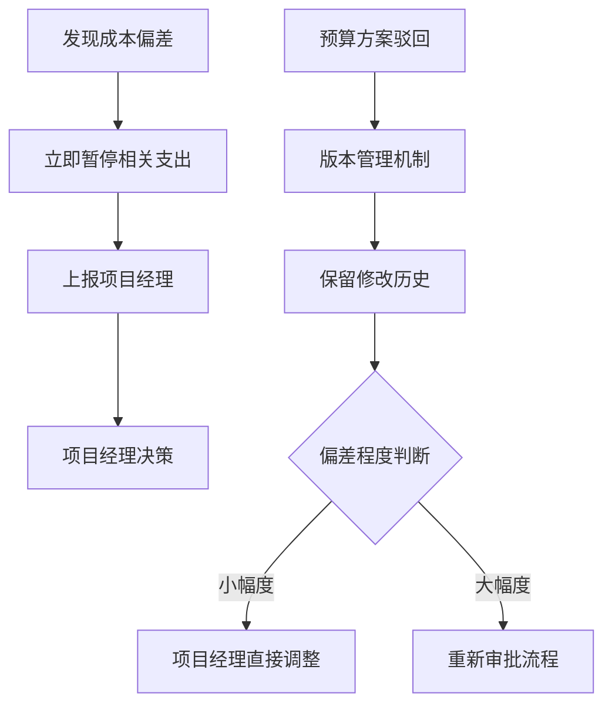
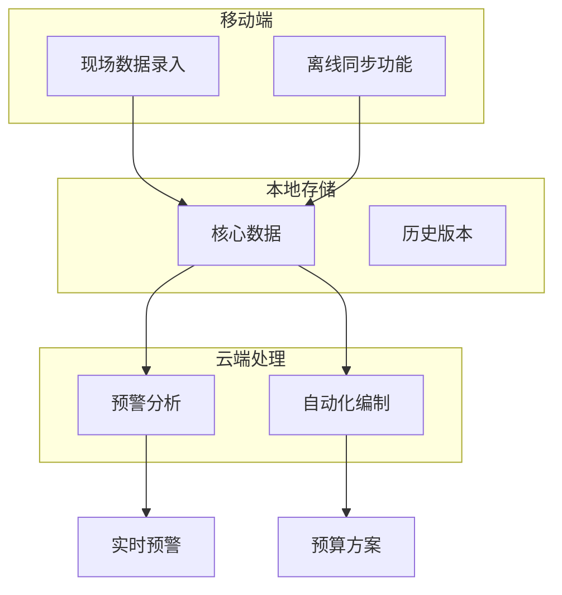
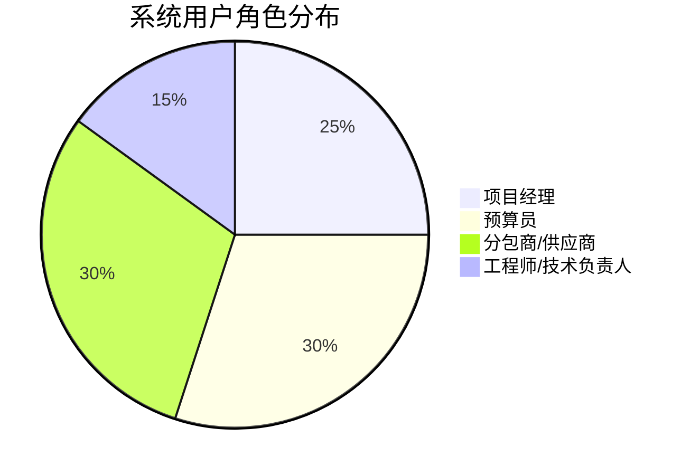

# 施工成本预算系统需求调研报告

## 1. 调研概述

### 1.1 基本信息
- **调研主题**: 施工成本预算
- **调研时间**: 近期
- **参与角色**: 项目经理、预算员、分包商、工程师等
- **参考文档**: 无

### 1.2 调研背景
本次调研旨在深入了解施工项目中成本预算管理的现状、痛点及需求，为设计符合实际业务需求的成本预算系统提供依据。调研涵盖了客户需求、业务流程、技术约束等多个维度。

## 2. 需求摘要

### 2.1 核心需求列表

| 需求编号 | 需求描述 | 类型 | 优先级 |
|---------|----------|------|--------|
| REQ-001 | 实时成本预警和超支预测 | 功能性 | 高 |
| REQ-002 | 自动化预算编制 | 功能性 | 高 |
| REQ-003 | 移动端优先设计 | 技术性 | 中 |
| REQ-004 | 混合部署架构 | 技术性 | 中 |
| REQ-005 | 版本管理机制 | 功能性 | 中 |
| REQ-006 | 审计日志记录 | 安全性 | 中 |
| REQ-007 | 角色权限管控 | 安全性 | 中 |

### 2.2 优先级矩阵

## 3. 详细需求分析

### 3.1 客户/用户需求

#### 3.1.1 核心痛点
1. **成本控制失效**: 预算执行过程中成本超支频繁，缺乏有效的成本控制和预警机制
2. **编制效率低下**: 预算编制耗时长、数据来源分散，难以快速生成准确的预算方案

#### 3.1.2 关键期望
1. **实时预警能力**: 实时成本预警和超支预测，在超支发生前提前预警
2. **自动化处理**: 自动化预算编制，快速汇总各部门数据生成预算方案

#### 3.1.3 用户角色
- **项目经理**: 成本决策、预算批准
- **预算员**: 预算编制、成本跟踪
- **分包商/供应商**: 成本数据录入和协作
- **工程师/技术负责人**: 技术方案成本评估

### 3.2 业务流程

#### 3.2.1 关键流程节点
1. **成本执行阶段**: 跟踪实际发生的成本，与预算进行对比分析
2. **预算审批阶段**: 相关负责人审核、批准预算方案并下达执行

#### 3.2.2 决策处理流程

### 3.3 技术约束

#### 3.3.1 架构要求
- **移动端优先**: 现场施工人员可随时录入成本数据，支持离线同步
- **混合部署**: 核心数据本地存储，预警分析功能云端处理

#### 3.3.2 安全合规要求
- **审计日志记录**: 成本数据变更的完整追溯
- **角色权限管控**: 不同岗位人员访问不同数据范围

### 3.4 项目约束
*本次调研暂未收集到项目约束相关数据*

## 4. 可视化分析

### 4.1 系统架构概览

### 4.2 用户权限分布

## 5. 方案建议

### 5.1 功能模块建议
1. **成本预警系统**: 建立基于阈值的多级预警机制，支持自定义预警规则
2. **自动化预算引擎**: 集成各数据源，提供模板化预算编制功能
3. **移动应用开发**: 优先开发移动端应用，确保现场作业便利性
4. **版本控制系统**: 实现预算方案的版本管理和变更追溯

### 5.2 技术实施建议
1. **采用渐进式Web应用(PWA)技术**: 同时满足移动端优先和离线同步需求
2. **实施微服务架构**: 支持混合部署，便于功能模块独立升级
3. **建立数据治理体系**: 确保数据质量和安全合规

## 6. 风险评估

### 6.1 潜在风险

| 风险类别 | 风险描述 | 影响程度 | 可能性 |
|---------|----------|----------|--------|
| 技术风险 | 移动端离线同步数据一致性问题 | 高 | 中 |
| 业务风险 | 用户接受度和使用习惯改变阻力 | 中 | 高 |
| 数据风险 | 敏感成本数据泄露 | 高 | 低 |
| 集成风险 | 与现有系统集成复杂度高 | 中 | 中 |

### 6.2 应对策略
1. **技术风险**: 采用成熟的离线同步框架，建立数据冲突解决机制
2. **业务风险**: 分阶段推广，提供充分培训和技术支持
3. **数据风险**: 实施数据加密、访问控制等多层安全防护
4. **集成风险**: 预先进行技术调研，制定详细的集成方案

## 7. 下一步行动

### 7.1 短期行动项（1-2周）
1. **需求确认**: 与关键用户确认需求优先级和详细规格
2. **技术选型**: 确定移动端开发框架和混合部署方案
3. **原型设计**: 基于核心需求设计系统原型

### 7.2 中期行动项（1-2个月）
1. **详细设计**: 完成系统架构设计和数据库设计
2. **安全规范**: 制定数据安全和权限管理规范
3. **开发计划**: 制定详细的开发里程碑和交付计划

### 7.3 长期行动项（3-6个月）
1. **系统开发**: 按模块优先级进行系统开发
2. **测试部署**: 进行全面测试和试点部署
3. **培训推广**: 用户培训和系统全面推广

## 8. 附录

### 8.1 完整访谈记录

#### 客户需求维度
**Q**: 在施工成本预算管理中，您目前面临的最主要痛点是什么？
**A**: 预算执行过程中成本超支频繁，缺乏有效的成本控制和预警机制；预算编制耗时长、数据来源分散，难以快速生成准确的预算方案

**Q**: 在解决预算超支和编制效率问题时，您最希望系统优先实现哪些功能？
**A**: 实时成本预警和超支预测，在超支发生前提前预警；自动化预算编制，快速汇总各部门数据生成预算方案

**Q**: 在您的施工项目中，除了项目经理和预算员，还有哪些角色需要使用成本预算系统？
**A**: 分包商/供应商（成本数据录入和协作）；工程师/技术负责人（技术方案成本评估）

#### 业务流程维度
**Q**: 在施工项目的成本预算全生命周期中，您认为最关键的流程节点有哪些？请选择适用于您项目的关键环节。
**A**: 成本执行阶段：跟踪实际发生的成本，与预算进行对比分析；预算审批阶段：相关负责人审核、批准预算方案并下达执行

**Q**: 在成本执行阶段的对比分析过程中，当发现实际成本与预算存在偏差时，您的团队通常采用什么处理流程？
**A**: 立即暂停相关支出，上报项目经理进行决策

**Q**: 在预算审批阶段，当预算方案被驳回或需要修改时，您的团队通常如何处理？特别是在修改后的预算需要重新审批时，现有的流程是否存在效率问题？
**A**: 使用版本管理机制，保留预算修改历史，支持快速对比和追溯修改过程；对于小幅度偏差修改，由项目经理直接调整预算，无需重新审批

#### 技术约束维度
**Q**: 基于您提到的实时成本预警、自动化预算编制等需求，系统在技术架构方面有哪些具体要求？
**A**: 移动端优先，现场施工人员可随时录入成本数据，支持离线同步；混合部署，核心数据本地存储，预警分析功能云端处理

**Q**: 基于您提到的移动端优先和混合部署需求，在系统安全合规方面，您的项目对数据安全有哪些具体要求？请选择所有适用的安全需求。
**A**: 审计日志记录（成本数据变更的完整追溯）；角色权限管控（不同岗位人员访问不同数据范围）

---

*报告生成时间: 基于提供的访谈记录*
*报告版本: v1.0*