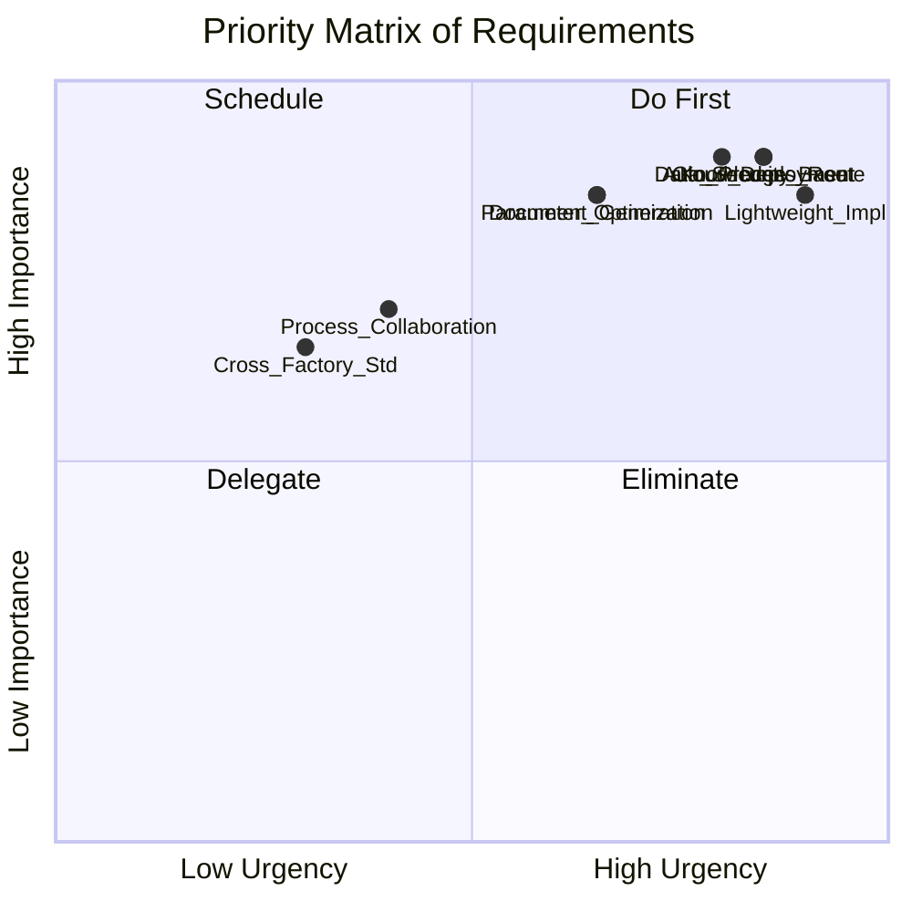
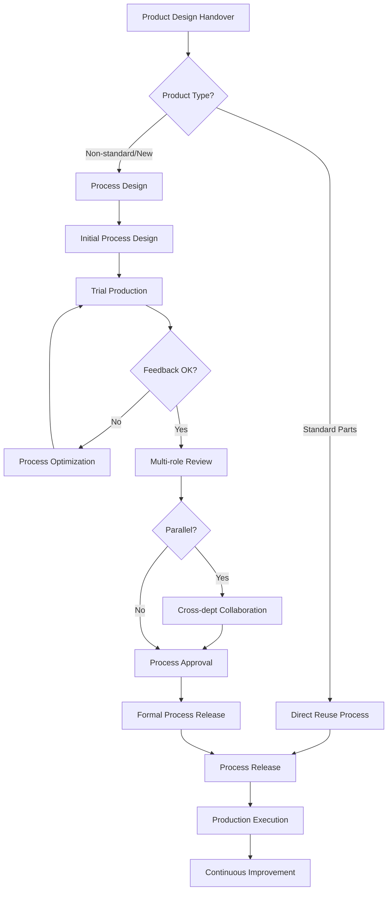

# AI+CAPP需求调研报告

## 1. 调研概述

### 1.1 基本信息
- **调研主题**：AI+CAPP需求调研
- **调研时间**：2024年
- **调研对象**：制造企业工艺管理相关人员
- **调研方式**：结构化访谈问卷

### 1.2 调研背景
本次调研旨在深入了解制造企业在计算机辅助工艺设计（CAPP）系统使用过程中面临的实际问题，以及对AI技术赋能CAPP系统的期望和需求。通过系统化的访谈，收集企业在工艺设计效率、知识管理、系统集成、项目实施等多个维度的真实痛点和具体诉求，为AI+CAPP解决方案的设计和实施提供依据。

---

## 2. 需求摘要

### 2.1 核心需求列表

| 需求类别 | 核心需求 | 优先级 | 紧急程度 |
|---------|---------|--------|---------|
| **功能需求** | 自动生成工艺路线和工序安排 | 高 | 高 |
| **功能需求** | 建立工艺知识库和经验库，支持快速复用 | 高 | 高 |
| **功能需求** | 工艺参数智能优化推荐 | 高 | 中 |
| **功能需求** | 工艺文档自动生成和版本控制 | 高 | 中 |
| **业务需求** | 支持分阶段工艺流程和多轮迭代 | 中 | 中 |
| **业务需求** | 工艺设计全流程协作优化 | 中 | 低 |
| **技术需求** | 云端部署与系统集成（ERP/PDM） | 高 | 高 |
| **技术需求** | 数据安全、加密与访问控制 | 高 | 高 |
| **技术需求** | 审计追溯与版本管理 | 高 | 中 |
| **项目需求** | 轻量化方案，分阶段实施 | 高 | 高 |
| **项目需求** | 跨工厂工艺标准化和知识共享 | 中 | 低 |

### 2.2 优先级矩阵

**优先级说明：**
- **第一象限（Do First - 立即实施）**：自动工艺路线生成、工艺知识库、云端部署、数据安全、轻量化实施方案
- **第二象限（Schedule - 计划排期）**：工艺参数优化、文档自动生成、流程协作优化
- **第三象限（Delegate - 后续扩展）**：跨工厂标准化
- **第四象限（Eliminate - 暂缓或取消）**：无

---

## 3. 详细需求分析

### 3.1 客户/用户需求

#### 3.1.1 核心痛点

**痛点1：工艺流程设计效率低**
- **具体表现**：手工编制工艺卡耗时长、容易出错
- **影响范围**：工艺工程师日常工作，工艺设计周期
- **严重程度**：高

**痛点2：工艺数据难以复用和管理**
- **具体表现**：知识积累不足导致重复劳动，工艺人员凭经验和记忆手工查找，依赖个人知识积累，效率低且容易遗漏
- **影响范围**：工艺设计质量和效率，企业知识资产流失
- **严重程度**：高

#### 3.1.2 期望解决的应用场景

**场景1：自动生成工艺路线和工序安排**（优先级：⭐⭐⭐⭐⭐）
- 减少手工编制工艺卡的时间
- 降低人为错误率
- 标准化工艺设计流程

**场景2：工艺知识库和经验库建设**（优先级：⭐⭐⭐⭐⭐）
- 支持相似工件的工艺快速复用和推荐
- 积累企业工艺知识资产
- 降低对个人经验的依赖

**场景3：工艺参数智能优化**（优先级：⭐⭐⭐⭐）
- 根据加工条件自动推荐刀具、转速、进给等工艺参数
- 提升工艺设计的科学性
- 优化生产效率和质量

**场景4：工艺文档自动生成和管理**（优先级：⭐⭐⭐⭐）
- 实现工艺卡、工序卡等标准化输出
- 版本控制和变更追溯
- 提升文档管理效率

#### 3.1.3 关键成功因素

客户认为以下因素对系统应用效果影响最大：

1. **行业和企业特有的工艺规范与约束条件**
   - AI需要理解和遵循特定的工艺标准
   - 满足质量要求和安全规范
   - 适配行业特殊要求

2. **系统集成能力**
   - 与现有ERP、PDM等系统的无缝衔接
   - 确保工艺数据能与整个制造执行链条联动
   - 数据流通畅、实时同步

3. **工艺人员接受度和使用习惯**
   - 改变传统手工编制的工作方式
   - 涉及培训和流程重构
   - 用户体验友好、学习成本低

4. **现有工艺数据质量**
   - 数据完整性和标准化程度
   - 直接影响AI模型的训练效果
   - 影响推荐准确度

#### 3.1.4 关键角色

- **工艺工程师**：核心用户，负责工艺设计、审批和优化
- **生产人员**：工艺执行方，提供生产反馈
- **质量人员**：参与工艺评审，提供质量要求
- **IT运维人员**：负责系统部署、集成和维护

---

### 3.2 业务流程需求

#### 3.2.1 工艺设计流程模式

企业采用**混合流程模式**，结合多种流程特点：

**流程特点：**
- **标准件/常规工艺**：直接调用和复用
- **非标件/新产品**：进行完整的工艺设计评审
- **分阶段流程**：初版工艺 → 试制验证 → 修改优化 → 正式发布 → 持续改进
- **并行协作**：产品设计同步进行工艺可行性分析，跨部门协作评审

#### 3.2.2 异常处理和工艺优化机制

企业期望的工艺优化机制是**智能决策型**：

**核心能力要求：**
- 利用数据分析和知识库，系统自动识别工艺异常和优化空间
- AI辅助工艺人员决策
- 支持灰度验证和快速迭代
- 建立快速反馈机制（24小时内小范围优化）
- 大范围变更走正式审批流程

**当前状态：**
- 被动响应型：生产现场出现问题后才进行临时调整
- 缺乏系统化的反馈和优化机制

**改进方向：**
1. 建立工艺变更申请流程和评审机制
2. 工艺、生产、质量部门快速反馈机制
3. AI自动识别异常和优化建议
4. 支持敏捷迭代和持续改进

#### 3.2.3 工艺复用和匹配机制

**当前状态：**
- 工艺人员凭经验和记忆手工查找
- 依赖个人知识积累
- 效率低且容易遗漏

**期望方案：**
- 建立工艺知识库和经验库
- AI智能推荐相似工艺
- 支持快速检索和复用
- 积累最佳实践

---

### 3.3 技术约束

#### 3.3.1 部署方案

**选择方案：云端部署**

**具体要求：**
- 采用SaaS模式或私有云部署
- 通过标准REST/WebService接口与ERP、PDM等系统集成
- 支持跨地域多工厂访问
- 需要网络稳定性和数据安全保障

#### 3.3.2 数据安全和合规性要求

**要求1：数据加密与访问控制**（关键）
- 工艺数据在传输和存储过程中加密
- 实现基于角色的访问控制（RBAC）
- 确保敏感工艺信息只有授权人员可见

**要求2：审计追溯与版本管理**（关键）
- 完整的操作日志审计
- 工艺变更历史追溯
- 版本控制
- 满足ISO/质量体系或行业合规要求（如汽车、航空等特殊行业）

**要求3：集成接口性能与稳定性**（关键）
- 与ERP/PDM系统的数据同步延迟控制在分钟级以内
- 接口调用成功率99%以上
- 支持异常重试机制

**要求4：系统可靠性与容灾备份**（关键）
- 系统99.9%以上可用性
- 支持异地容灾备份
- 业务连续性保障
- 工艺系统中断时业务能快速恢复

**要求5：数据本地化与隐私保护**（关键）
- 出于商业机密或监管要求
- 工艺数据不离开国内或特定地域
- 需要国内私有云或专有部署方案

#### 3.3.3 IT基础设施现状

**现状：已建立完整的IT集成平台**

**具备能力：**
- 专业的API网关
- 消息队列（如MQ）
- ETL工具
- 成熟的集成运维能力和技术支撑团队

**优势：**
- 有利于系统快速集成
- 降低集成技术风险
- 可复用现有基础设施

---

### 3.4 项目约束

#### 3.4.1 实施约束条件

**约束特点：多维度限制**

1. **预算有限**
   - 需要控制初期投入
   - 分阶段投资
   - 注重投资回报率

2. **周期紧张**
   - 希望快速见效
   - 不能影响正常生产
   - 分阶段交付

3. **人员资源紧张**
   - 现有工艺人员工作负荷重
   - 无法投入太多精力配合系统建设
   - 需要降低培训成本

**应对策略：**
- 采用最小化配置初期上线
- 后续持续演进的轻量化方案
- 快速迭代、小步快跑

#### 3.4.2 分阶段实施计划

**第一阶段（3-6个月）- 核心功能上线**

优先实现以下功能：

1. **工艺路线和工序自动生成**
   - 减少手工编制工艺卡的时间和错误
   - 优先级：⭐⭐⭐⭐⭐

2. **工艺知识库建设和相似工艺推荐检索**
   - 快速复

---

## 附录：完整访谈记录

> 本次调研共收集了 12 个问题的回答

### Q1: 在您的制造企业中，使用CAPP系统时主要面临哪些核心痛点？（请选择最符合您情况的选项）

**回答**: 工艺流程设计效率低，手工编制工艺卡耗时长、容易出错；工艺数据难以复用和管理，知识积累不足导致重复劳动

**维度**: 客户需求

*记录时间: 2026-01-26T03:28:59Z*

---

### Q2: 针对工艺流程设计效率低和工艺数据难以复用的问题，您希望AI+CAPP系统首先解决以下哪个具体的应用场景？

**回答**: 自动生成工艺路线和工序安排，减少手工编制工艺卡的时间；建立工艺知识库和经验库，支持相似工件的工艺快速复用和推荐；工艺参数智能优化，根据加工条件自动推荐刀具、转速、进给等工艺参数；工艺文档自动生成和管理，实现工艺卡、工序卡等标准化输出和版本控制

**维度**: 客户需求

*记录时间: 2026-01-26T03:29:14Z*

---

### Q3: 在实施AI+CAPP系统时，您认为以下哪些因素会对系统的应用效果产生最大影响？（请选择最关键的2-3个）

**回答**: 行业和企业特有的工艺规范与约束条件——AI需要理解和遵循特定的工艺标准、质量要求、安全规范等；系统与现有ERP、PDM等系统的集成能力——确保工艺数据能与整个制造执行链条无缝衔接；工艺人员的接受度和使用习惯——需要改变传统手工编制的工作方式，涉及培训和流程重构；现有工艺数据的完整性和标准化程度——数据质量直接影响AI模型的训练效果和推荐准确度

**维度**: 客户需求

*记录时间: 2026-01-26T03:29:27Z*

---

### Q4: 在您企业的工艺设计流程中，从产品设计交付到最终工艺卡下达，通常涉及哪些关键角色和流程节点？请选择最符合您情况的工艺设计流程模式。

**回答**: 分阶段流程：初版工艺 → 试制验证 → 根据试制反馈修改优化 → 正式工艺发布 → 生产执行中持续改进，工艺需经历多轮迭代；混合流程：标准件/常规工艺直接调用和复用，非标件/新产品才进行工艺设计评审，不同产品采用差异化流程；并行流程：产品设计同步进行工艺可行性分析 → 多角色协作（工艺、生产、质量等）评审 → 工艺优化迭代 → 最终下达，涉及跨部门协作；顺序流程：产品设计 → 工艺工程师手工分析 → 工艺审批 → 工艺卡下达生产，各环节串联进行，周期较长

**维度**: 业务流程

*记录时间: 2026-01-26T03:29:42Z*

---

### Q5: 在您企业的工艺设计流程中，当面临工艺设计变更、生产反馈、或质量问题时，目前采用什么样的异常处理和工艺优化机制？

**回答**: 被动响应型：生产现场出现问题后，工艺人员才进行临时调整和改进，缺乏系统化的反馈和优化机制；主动管理型：建立了工艺变更申请流程，通过评审委员会审批，变更内容记录在案并可追溯，但响应周期较长（通常1-2周）；敏捷迭代型：工艺、生产、质量等部门建立快速反馈机制，可在24小时内完成小范围工艺优化，大范围变更走正式审批流程；智能决策型：利用数据分析和知识库，系统自动识别工艺异常和优化空间，AI辅助工艺人员决策，支持灰度验证和快速迭代

**维度**: 业务流程

*记录时间: 2026-01-26T03:29:54Z*

---

### Q6: 在工艺设计流程中，当需要调用或复用已有工艺时，目前主要依靠什么方式来查找和匹配相似或相关的工艺？

**回答**: 工艺人员凭经验和记忆手工查找，依赖个人知识积累，效率低且容易遗漏

**维度**: 业务流程

*记录时间: 2026-01-26T03:30:04Z*

---

### Q7: 在实施AI+CAPP系统时，贵企业的现有IT基础设施和系统集成环境如何？请选择最符合贵企业情况的部署和集成方案

**回答**: 云端部署：采用SaaS模式或私有云部署，系统通过标准REST/WebService接口与ERP、PDM等系统集成；支持跨地域多工厂访问，需要网络稳定性和数据安全保障

**维度**: 技术约束

*记录时间: 2026-01-26T03:30:12Z*

---

### Q8: 在采用云端部署的AI+CAPP系统时，贵企业对以下数据安全和合规性方面有哪些具体要求？（请选择所有适用的）

**回答**: 集成接口的性能与稳定性——要求与ERP/PDM系统的数据同步延迟控制在分钟级以内，接口调用成功率99%以上，支持异常重试机制；审计追溯与版本管理——要求完整的操作日志审计、工艺变更历史追溯、版本控制，满足ISO/质量体系或行业合规要求（如汽车、航空等特殊行业）；系统可靠性与容灾备份——要求系统99.9%以上可用性，支持异地容灾备份和业务连续性保障，确保工艺系统中断时业务能快速恢复；数据本地化与隐私保护——出于商业机密或监管要求，要求工艺数据不离开国内或特定地域，需要国内私有云或专有部署方案；数据加密与访问控制——要求工艺数据在传输和存储过程中加密，实现基于角色的访问控制（RBAC），确保敏感工艺信息只有授权人员可见

**维度**: 技术约束

*记录时间: 2026-01-26T03:30:24Z*

---

### Q9: 在采用云端部署的AI+CAPP系统时，贵企业的现有IT基础设施中是否已有成熟的API网关、消息队列、或数据集成平台？这些基础设施对系统集成的支持程度如何？

**回答**: 已建立完整的IT集成平台：有专业的API网关、消息队列（如MQ）、ETL工具等，具备成熟的集成运维能力和技术支撑团队

**维度**: 技术约束

*记录时间: 2026-01-26T03:30:35Z*

---

### Q10: 关于AI+CAPP系统的实施规划，贵企业对项目投入的预算范围、实施周期和资源配置有什么具体考虑？请选择最符合贵企业情况的实施约束条件。

**回答**: 实施约束条件多维度限制：预算有限、周期紧张、现有工艺人员工作负荷重无法投入太多精力配合系统建设，需要采用最小化设置初期上线，后续持续演进的轻量化方案

**维度**: 项目约束

*记录时间: 2026-01-26T03:30:45Z*

---

### Q11: 根据您之前提到需要采用轻量化方案初期上线、后续持续演进的策略，请问在AI+CAPP系统的分阶段实施中，贵企业最希望在第一阶段（3-6个月内）优先实现以下哪些核心功能？

**回答**: 工艺文档自动生成和版本管理——实现工艺卡标准化输出和变更追溯；工艺参数智能优化和推荐——自动推荐刀具、转速、进给等参数；工艺知识库建设和相似工艺推荐检索——快速复用现有工艺，降低重复劳动；工艺路线和工序自动生成——减少手工编制工艺卡的时间和错误

**维度**: 项目约束

*记录时间: 2026-01-26T03:30:55Z*

---

### Q12: 在AI+CAPP系统的后续阶段实施中（第二阶段6-12个月），贵企业还需要在以下哪些方面进行扩展和深化？请根据实际需求选择。

**回答**: 工艺设计全流程协作优化——支持产品设计、工艺、生产、质量等部门的并行协作，加快工艺设计评审和批量定制化工艺方案的生成；跨工厂工艺标准化和工艺库共享——在企业多个生产基地间实现工艺标准统一、最佳实践共享和工艺资源的集中管理

**维度**: 项目约束

*记录时间: 2026-01-26T03:36:59Z*

---

