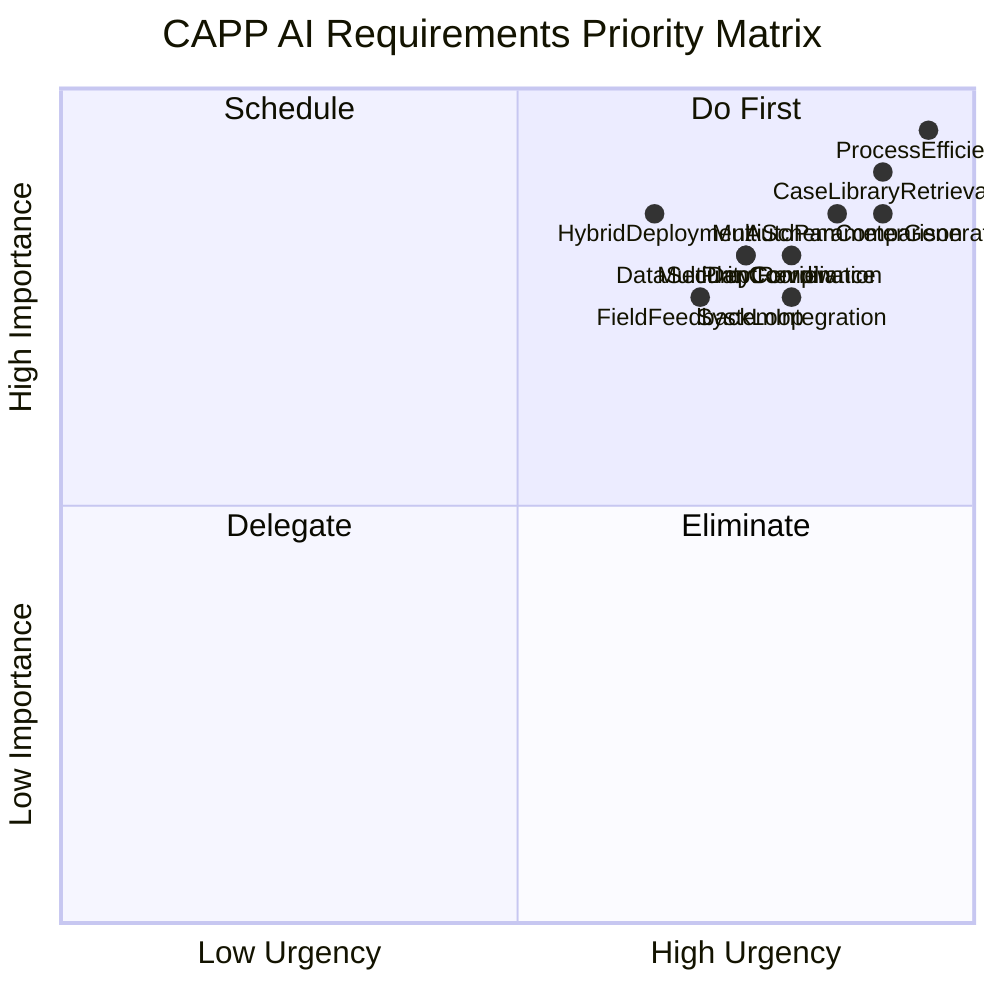
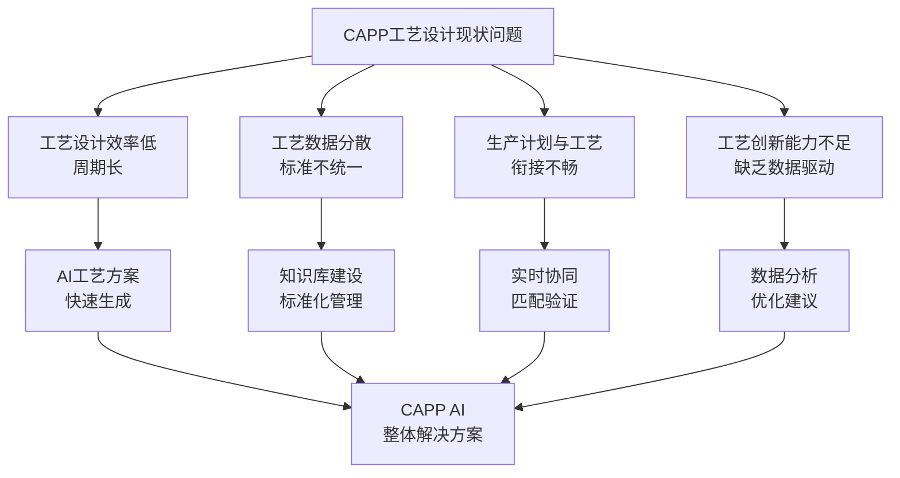
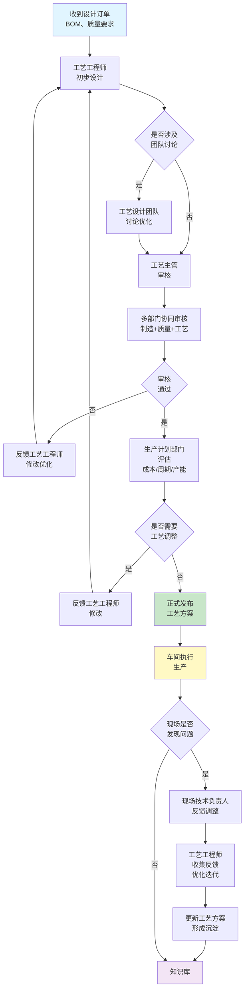
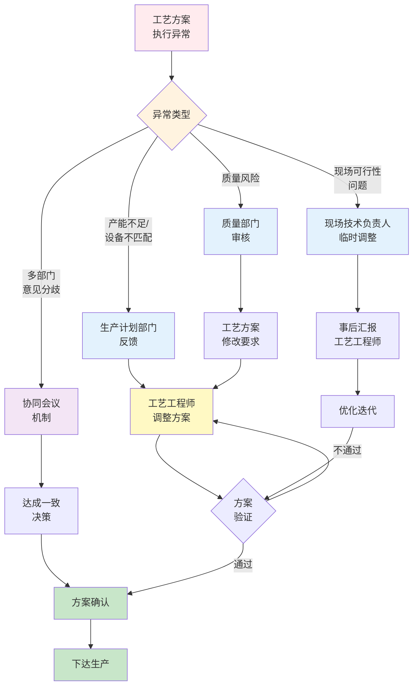

# CAPP AI场景应用需求调研报告

## 1. 调研概述

### 1.1 基本信息
- **调研主题**：CAPP AI场景应用调研
- **调研对象**：制造企业工艺设计部门
- **调研方式**：深度访谈
- **参考资料**：开目AI+CAPP.pdf
- **报告日期**：2024年

### 1.2 调研背景
制造企业在推进数字化转型的过程中，工艺设计环节仍存在效率低、周期长、知识难以沉淀等问题。CAPP（计算机辅助工艺规划）AI技术作为智能制造的关键技术，能够通过人工智能和机器学习算法辅助工艺工程师加快工艺方案设计、优化工艺参数、降低设计成本。本次调研旨在深入理解制造企业实施CAPP AI解决方案的核心需求、业务流程、技术约束和项目约束，为系统方案设计提供有力支撑。

---

## 2. 需求摘要

### 2.1 核心需求列表

| 优先级 | 需求类别 | 具体需求 | 业务价值 |
|-------|--------|--------|--------|
| **P0** | 工艺设计效率提升 | 快速生成工艺方案，缩短工艺设计周期 | 直接提升产能，减少交期延误 |
| **P0** | 工艺案例复用 | 历史工艺案例库检索与相似方案推荐 | 降低设计成本，加速新品设计 |
| **P0** | AI参数自动生成 | 工序划分、切削参数等自动计算 | 提升设计精准度，减少人工经验依赖 |
| **P0** | 多方案对比优化 | 成本、周期、质量维度的权衡分析 | 数据驱动决策，提升工艺设计质量 |
| **P1** | 工艺与计划协同 | 与生产计划系统实时协同 | 保证工艺方案的可行性和及时性 |
| **P1** | 多部门协同审核 | 工艺、制造、质量等部门协同机制 | 降低设计风险，提升审核效率 |
| **P1** | 现场反馈与迭代 | 工艺方案执行反馈机制与持续优化 | 闭环反馈，持续改进工艺设计 |
| **P2** | 混合部署架构 | 本地/私有云+云端服务混合部署 | 保证数据安全与系统可靠性 |
| **P2** | 系统集成 | 与ERP/MES/PDM系统集成 | 实现工艺设计与生产执行的无缝衔接 |
| **P2** | 数据安全合规 | 核心工艺数据本地存储，加密传输 | 保护企业知识资产，满足行业合规 |

### 2.2 优先级矩阵

**说明**：
- **Do First（优先执行）**：工艺设计效率提升、案例库检索、参数自动生成、多方案对比
- **Schedule（计划推进）**：与计划协同、多部门协同审核、混合部署、数据安全
- **Delegate（外包处理）**：现场反馈与迭代（初期可由业务部门自行管理）
- **Eliminate（暂不考虑）**：无

---

## 3. 详细需求分析

### 3.1 客户/用户需求分析

#### 3.1.1 业务痛点分析

**详细痛点描述**：

1. **工艺设计效率低、周期长**
   - 现状：工艺设计严重依赖人工经验，无法快速生成方案
   - 影响：新品设计周期长，难以应对市场需求变化
   - 期望：通过AI辅助快速生成工艺方案，设计周期缩短30-50%

2. **工艺数据分散、标准不统一**
   - 现状：历史工艺案例分散在不同部门、系统，格式不统一，难以查询和复用
   - 影响：知识无法沉淀，重复设计浪费资源
   - 期望：建立规范化的工艺知识库，快速调用相似案例

3. **生产计划与工艺衔接不畅**
   - 现状：工艺方案生成后，与生产计划部门沟通反复，或生成后才发现产能不足
   - 影响：排产效率低，交期延误
   - 期望：工艺设计过程中实时考虑产能、设备、交期等因素

4. **工艺创新能力不足**
   - 现状：缺乏数据驱动的工艺优化方案，工艺改进靠经验
   - 影响：无法充分发挥设备和材料潜力
   - 期望：通过数据分析驱动工艺优化，成本/周期/质量持续改进

#### 3.1.2 核心用户角色与期望

| 用户角色 | 主要职责 | 关键期望 | 痛点 |
|---------|--------|--------|------|
| **工艺工程师** | 工艺方案设计与优化 | AI辅助快速生成方案、参数建议；历史案例快速调用；设计效率提升 | 设计周期长、案例难查、参数计算繁琐 |
| **工艺主管** | 审核和优化工艺方案 | 快速审核方案、多维度对比分析、风险识别 | 审核维度多、数据不透明、决策效率低 |
| **制造工程师** | 评估制造可行性 | 方案的可制造性评估、设备/工艺匹配提示 | 沟通反复、可行性问题频繁出现 |
| **质量工程师** | 识别质量风险 | 质量风险提前预警、工艺参数对质量的影响分析 | 风险识别滞后、设计阶段难以评估 |
| **生产计划部门** | 排产与执行 | 工艺方案与产能/设备匹配验证、排产优化建议 | 常需返工沟通、产能矛盾难解决 |
| **现场技术负责人** | 生产执行与反馈 | 工艺方案的实际可行性验证、异常反馈与迭代 | 设计与现场脱节、调整反馈滞后 |

#### 3.1.3 核心应用场景

| 场景 | 描述 | 期望AI能力 | 业务收益 |
|-----|------|----------|--------|
| **新品工艺设计** | 基于产品BOM和工艺要求，快速生成初步工艺方案 | 相似零件案例推荐、工序划分建议、参数自动生成 | 设计周期缩短40-50%，工程师效率提升 |
| **工艺方案优化** | 对已有方案进行成本、周期、质量维度的多目标优化 | 参数优化、方案对比、敏感性分析 | 成本降低10-15%，周期缩短10-20% |
| **工艺与产能匹配** | 验证工艺方案与当前产能、设备、人力的匹配度 | 产能预测、设备匹配、排产优化建议 | 减少返工沟通，交期延误率降低 |
| **工艺知识沉淀** | 将成功的工艺方案和经验规范化，形成可复用的知识库 | 知识提取、规范化存储、智能搜索 | 新员工培训周期缩短，设计一致性提升 |
| **现场反馈与迭代** | 生产现场发现问题时，快速反馈给工艺部门优化 | 问题分类、根本原因分析、优化建议 | 问题响应速度快，工艺持续改进 |

---

### 3.2 业务流程分析

#### 3.2.1 工艺设计与生产执行完整流程

**流程关键特点**：
- 多轮反馈迭代，设计周期长
- 多部门并行审核，沟通成本高
- 现场反馈滞后，知识沉淀困难

#### 3.2.2 关键决策节点

| 决策节点 | 关键参与者 | 决策内容 | 当前问题 | AI支持方向 |
|---------|----------|--------|--------|----------|
| **工艺初稿完成** | 工艺工程师 | 是否开启团队讨论 | 无明确决策标准 | 基于复杂度、相似度的智能建议 |
| **工艺审核通过** | 工艺主管+制造+质量 | 方案是否可行 | 维度多、数据不全、主观性强 | 多维度风险预警、智能决策支持 |
| **产能匹配验证** | 生产计划部门 | 是否需要调整工艺 | 常发现不匹配需返工 | 实时产能预测、工艺-产能自动匹配 |
| **现场执行反馈** | 现场技术负责人 | 是否需要临时调整 | 应急决策，缺乏标准 | 基于历史案例的快速决策建议 |
| **设计方案定稿** | 工艺工程师+主管 | 方案固化与发布 | 知识沉淀不系统 | 自动知识提取、规范化存储 |

#### 3.2.3 异常处理与协调机制

**异常处理特点**：
- 多源异常，处理路径复杂
- 临时决策与事后优化并存
- 协调成本高，周期长
- 缺乏标准化的处理流程

**AI支持方向**：
- 异常预警：基于历史数据预测潜在异常
- 智能推荐：针对不同异常类型推荐最优处理方案
- 协同决策：多部门意见的智能整合与决策支持
- 知识沉淀：异常处理经验的自动提取与复用

---

## 附录：完整访谈记录

> 本次调研共收集了 12 个问题的回答

### Q1: 在您的制造企业中，应用CAPP AI技术时，最主要的业务痛点是什么？

**回答**: 工艺设计效率低、周期长，需要大量人工经验积累；工艺数据分散、标准不统一，难以形成知识沉淀和复用；生产计划与工艺衔接不畅，导致排产效率低或交期延误；工艺创新能力不足，缺乏数据驱动的工艺优化方案

**维度**: 客户需求

*记录时间: 2026-01-26T07:05:28Z*

---

### Q2: 针对您提到的这些痛点，在实施CAPP AI解决方案时，您最希望优先解决的核心业务问题是什么？

**回答**: 工艺设计效率提升 - 通过AI辅助快速生成工艺方案，缩短工艺设计周期

**维度**: 客户需求

*记录时间: 2026-01-26T07:05:39Z*

---

### Q3: 在实施CAPP AI工艺设计效率提升方案时，您期望该方案主要支持以下哪些具体的工艺设计场景或工作流程？（可多选）

**回答**: 快速调用历史工艺案例库，基于相似零件自动推荐工艺方案模板；AI辅助工艺工程师进行工序划分、加工工艺参数自动生成（如切削速度、进给量等）；工艺方案的多方案对比与优化，包括成本、周期、质量等维度的权衡；与生产计划系统的实时协同，确保工艺方案与产能、设备、交期的匹配

**维度**: 客户需求

*记录时间: 2026-01-26T07:06:01Z*

---

### Q4: 在您的制造企业中，工艺设计方案从生成到最终下达生产现场的完整流程中，通常涉及哪些关键角色和流程节点？请选择适用于贵企业的情况

**回答**: 工艺工程师独立完成工艺设计 → 工艺主管审核 → 生产计划部门确认产能 → 下达生产指令；工艺工程师提出初稿 → 工艺设计团队讨论优化 → 工艺工程师(主设计) + 制造工程师(制造可行性) + 质量工程师(质量风险) 协同审核 → 生产计划执行；工艺工程师生成方案 → 车间主任/现场技术负责人实际反馈调整 → 设计方案优化迭代 → 正式发布；工艺设计方案 → 生产计划部门评估(成本/周期) → 若需变更则反馈工艺工程师修改 → 最终确认发布 → 生产执行

**维度**: 业务流程

*记录时间: 2026-01-26T07:06:17Z*

---

### Q5: 在工艺方案从生成到生产执行的过程中，当出现以下异常情况时，您的企业通常如何处理？请选择实际发生过或可能发生的异常处理方式

**回答**: 工艺方案生成后，生产计划部门发现产能不足或设备不匹配，需要工艺工程师调整加工方案（如改变工序、调整工艺参数或拆分订单）；生产现场在执行工艺方案时发现实际可行性问题（如刀具不可用、夹具不适配），需要临时调整，反馈给工艺工程师进行优化迭代；质量部门在工艺审核中发现潜在的质量风险（如公差难以保证、表面质量难以满足），要求工艺方案修改；多个部门（工艺、制造、质量、生产计划）对工艺方案存在意见分歧，需要通过协同机制达成一致后才能下达生产

**维度**: 业务流程

*记录时间: 2026-01-26T07:06:30Z*

---

### Q6: 在工艺方案执行过程中，当工艺设计与生产现场的实际情况存在偏差时，您的企业目前采用什么样的信息反馈和决策机制来处理？特别是在以下场景中，谁负责最终决策？

**回答**: 由生产现场（车间主任/现场技术负责人）直接调整执行方案，事后向工艺工程师汇报；工艺工程师根据反馈进行优化迭代

**维度**: 业务流程

*记录时间: 2026-01-26T07:06:43Z*

---

### Q7: 在实施CAPP AI解决方案时，您的企业对系统集成和部署方式有什么要求？特别是考虑到需要与工艺设计、生产计划、质量管理等多个部门系统协同，请问贵企业倾向于以下哪种部署和集成方式？

**回答**: 混合部署 - 核心AI模型和工艺数据库部署在本地/私有云，通过安全网关与云端的AI推理服务交互

**维度**: 技术约束

*记录时间: 2026-01-26T07:06:57Z*

---

### Q8: 针对您选择的混合部署方案（核心AI模型和工艺数据库部署在本地/私有云），在与云端AI推理服务交互时，您的企业对以下哪些技术指标和安全要求最为关键？

**回答**: 与现有ERP/MES/PDM系统的集成接口 - 需要通过API/WebService与工艺库、BOM、生产计划等系统实时同步；对接口规范、数据格式、集成复杂度有具体要求；系统可靠性和容灾能力 - 云端服务异常时本地仍需独立运行，确保生产不中断；需要本地模型的离线推理能力或降级方案；数据安全和隐私保护 - 企业核心工艺数据和设计知识库不能完全上传云端；需要加密传输和访问控制机制；需要符合特定行业合规要求（如汽车、航空等）；实时性要求 - 工艺方案推荐和AI参数计算的响应时间需在500ms以内；工艺设计过程中需要秒级反馈

**维度**: 技术约束

*记录时间: 2026-01-26T07:07:09Z*

---

### Q9: 您的企业在实施CAPP AI混合部署方案时，现有的IT基础设施和技术栈情况如何？特别是在本地/私有云部署AI模型和工艺数据库时，需要克服哪些技术挑战？

**回答**: 现有IT基础设施相对完善（有私有云平台、容器编排、负载均衡等），主要挑战是AI模型的本地部署优化和与现有系统的集成适配；IT基础设施基础但存在瓶颈，需要升级存储、计算资源来支持本地AI推理；同时需要建立云边协同的数据同步机制；缺乏成熟的私有云基础设施，倾向于采用轻量级本地部署方案（如模型压缩、边缘推理）并依赖云端服务；主要关注网络稳定性和离线降级方案；正在建设或规划IT基础设施现代化，CAPP AI实施需要与整体数字化转型架构适配；需要咨询完整的技术架构方案和分阶段实施路径

**维度**: 技术约束

*记录时间: 2026-01-26T07:07:25Z*

---

### Q10: 在实施CAPP AI解决方案时，您的企业对项目周期和预算投入有什么样的要求和限制？特别是考虑到需要与现有系统集成、员工培训、以及可能的流程优化，请问贵企业的项目实施计划和预算规划如何？

**回答**: 快速试点阶段（3-6个月，预算100-300万元）- 优先实现工艺设计效率提升的核心功能，采用轻量级部署，后续逐步扩展；中期实施阶段（6-12个月，预算300-600万元）- 包含系统集成、部分流程优化、员工培训等，支持混合部署架构，覆盖主要工艺设计场景；长期建设阶段（12-36个月，预算600万元以上）- 完整的数字化转型方案，包含基础设施升级、全面系统集成、知识库建设、持续优化迭代等；预算和周期灵活（需要分阶段评估）- 优先级不同，需要根据具体项目范围、现有系统复杂度、人力资源等因素进行定制化规划

**维度**: 项目约束

*记录时间: 2026-01-26T07:08:35Z*

---

### Q11: 在实施CAPP AI解决方案的过程中，您的企业在项目执行层面还面临哪些具体的资源和组织挑战？特别是涉及到技术团队、业务部门协同、数据准备和人员培训等方面，贵企业目前的制约因素有哪些？

**回答**: 技术团队能力不足 - 缺少AI/机器学习专业人才，主要依赖外部咨询和实施服务商支撑；业务部门协同困难 - 工艺、制造、质量、计划等部门沟通协调复杂，难以形成统一的需求和流程标准；工艺数据基础薄弱 - 现有的工艺知识库不完善、数据质量不高、历史数据难以规范化整理作为AI训练基础；员工认知和接受度低 - 工艺工程师等关键用户对AI工具的理解和使用意愿不足，需要较长的适应和培训周期；上述多个方面都存在挑战 - 需要综合解决技术、组织、数据、人员等多层面问题

**维度**: 项目约束

*记录时间: 2026-01-26T07:14:34Z*

---

### Q12: 在实施CAPP AI解决方案时，您的企业在以下哪些方面存在具体的实施制约因素？这些因素可能会影响项目的实际推进速度和效果。请选择实际存在或预期会遇到的约束：

**回答**: 预算执行灵活性受限 - 需要在财年初或特定时期完成预算审批，不支持跨年度滚动投入；或者需要明确的ROI评估和成本分摊方案才能获得资金批准；关键业务人员投入不足 - 工艺工程师、生产计划人员等核心用户日常生产任务繁重，难以抽出充足时间参与需求调研、流程优化和系统培训；现有系统升级或替换的时间窗口有限 - 需要利用生产淡季或计划停产期进行系统切换，或者现有ERP/MES/PDM系统仍在合同期内无法灵活调整集成方案；数据治理和知识库建设周期长 - 工艺历史数据分散、格式不统一、需要大量人工梳理和标准化，预计数据准备阶段需要3-6个月，影响AI模型训练和上线时间

**维度**: 项目约束

*记录时间: 2026-01-26T07:15:24Z*

---

