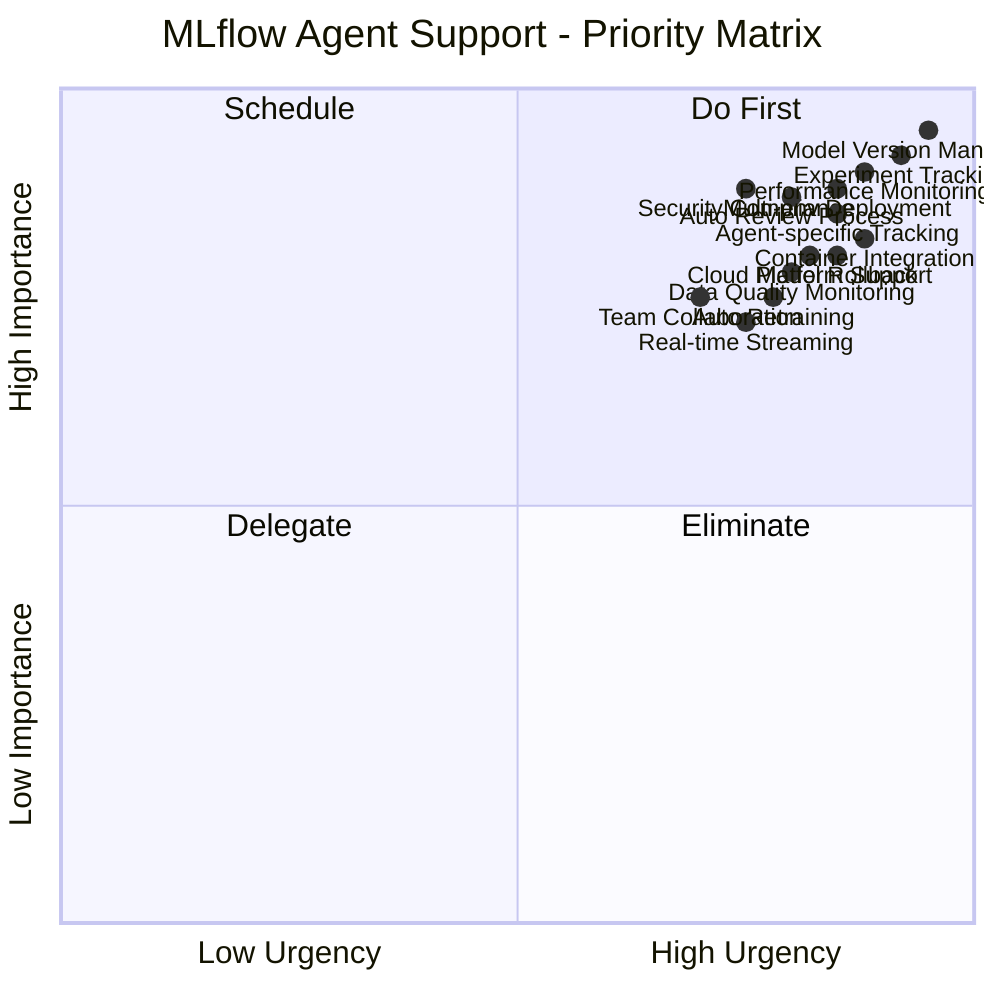
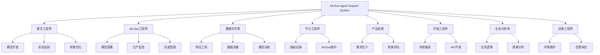
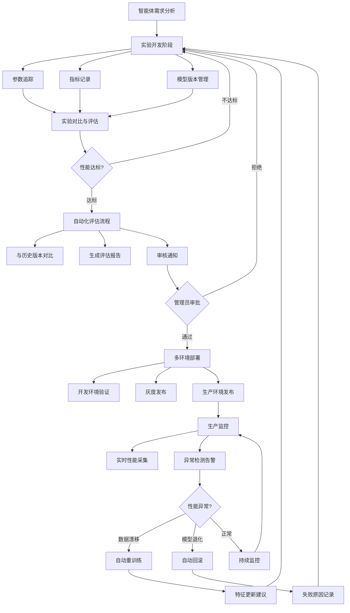

# MLflow对智能体支撑需求调研报告

## 1. 调研概述

### 1.1 基本信息

| 项目 | 内容 |
|------|------|
| **调研主题** | MLflow对智能体的支撑 |
| **调研方式** | 深度访谈 |
| **参与角色** | 算法工程师、MLOps工程师、数据科学家、平台工程师、产品经理、开发工程师、业务分析师、运维工程师 |
| **调研日期** | 2024年 |
| **预算规模** | >100万 |
| **时间周期** | 6个月以上 |

### 1.2 调研背景

当前组织在构建和部署智能体应用过程中，遭遇了模型版本管理、实验追踪、生命周期自动化等多维度的挑战。MLflow作为行业领先的机器学习生命周期管理平台，需要针对智能体的特殊需求进行深度适配和扩展。本次调研旨在识别MLflow在智能体应用中的核心需求、技术瓶颈和实现路径。

---

## 2. 需求摘要

### 2.1 核心需求清单

#### 功能性需求（11项）
1. **模型版本管理与追踪** - 完整的智能体模型迭代版本控制
2. **实验管理与对比** - 参数追踪、A/B测试和实验对比工具
3. **性能监控与异常检测** - 实时性能指标采集和异常告警
4. **团队协作平台** - 知识共享和跨团队协作机制
5. **多环境部署管理** - 环境配置和自动化部署流程
6. **自动化审核流程** - 实验完成后的自动评估和版本对比
7. **模型回滚机制** - 部署失败的自动回滚和灰度管理
8. **自动化重训练** - 性能下降时的自动化触发机制
9. **智能体专有特性追踪** - Prompt版本、工具调用、上下文管理追踪
10. **完整执行路径记录** - 生产异常时的追踪和诊断支持
11. **数据质量监控** - 特征漂移检测和数据质量报告

#### 技术集成需求（6项）
12. **容器化部署支持** - Docker/Kubernetes深度集成
13. **云平台原生支持** - AWS/阿里云/腾讯云集成
14. **数据平台联动** - 与特征平台和数据管道的集成
15. **智能体框架适配** - LangChain、AutoGen、RAG系统支持
16. **监控系统联动** - Prometheus、ELK等的无缝集成
17. **元数据管理扩展** - 大规模artifact存储和高效查询

#### 安全合规需求（4项）
18. **身份认证集成** - LDAP、OAuth2、SAML支持
19. **多租户隔离** - 数据主权和隔离保障
20. **审计日志体系** - 完整的操作追踪和合规检查
21. **数据加密保护** - 传输层和存储层加密

#### 性能需求（4项）
22. **实时流处理能力** - 实时指标采集和流式日志处理
23. **大规模存储支持** - GB/TB级别的artifact存储
24. **高并发推理服务** - 低延迟的模型服务和版本切换
25. **并发实验追踪** - 数百个并发实验的管理能力

### 2.2 需求优先级矩阵



**优先级说明：**
- **Do First (第一象限)** - 立即启动，影响整体项目成功
  - 模型版本管理、实验追踪、性能监控、多环境部署、自动化审核
  
- **Schedule (第二象限)** - 计划实施，重要但时间相对充裕
  - 安全合规、容器集成、智能体特性追踪、模型回滚
  
- **Delegate (第三象限)** - 可降级处理或外包实施
  - 团队协作、实时流处理、数据质量监控
  
- **Eliminate (第四象限)** - 低优先级，可延期或简化
  - 无

---

## 3. 详细需求分析

### 3.1 客户/用户需求分析

#### 3.1.1 核心痛点

| 痛点 | 影响范围 | 严重程度 | 对应需求 |
|------|---------|---------|---------|
| 模型版本管理和追踪困难 | 所有角色 | 极高 | 模型版本管理、实验追踪 |
| 实验对比工具缺乏 | 算法工程师、数据科学家 | 高 | 实验管理与对比、A/B测试支持 |
| 性能监控不足 | MLOps工程师、运维工程师 | 高 | 性能监控、异常检测 |
| 团队协作缺失 | 全团队 | 中高 | 知识共享、协作平台 |
| 多环境部署复杂 | MLOps工程师、开发工程师 | 高 | 环境配置、自动化部署 |

#### 3.1.2 关键使用场景

**场景1: 实验开发阶段**
- 用户：算法工程师、数据科学家
- 期望：快速追踪参数、指标、代码版本，支持多实验并行对比
- 需求：参数自动记录、指标可视化、实验对比工具

**场景2: 模型评估和审批阶段**
- 用户：产品经理、算法工程师、MLOps工程师
- 期望：自动触发评估流程，与历史版本对比，支持管理员审核
- 需求：自动评估触发、版本对比、审核流程管理

**场景3: 生产部署阶段**
- 用户：MLOps工程师、开发工程师、运维工程师
- 期望：多环境配置管理、灰度发布、自动回滚
- 需求：灰度部署支持、一键回滚、失败告警

**场景4: 生产监控阶段**
- 用户：MLOps工程师、运维工程师、业务分析师
- 期望：实时性能监控、异常告警、根因诊断
- 需求：实时监控、完整追踪、自动告警

**场景5: 故障排查阶段**
- 用户：算法工程师、MLOps工程师
- 期望：快速定位问题、回溯执行路径、对比历史版本
- 需求：执行追踪、日志记录、快速诊断

#### 3.1.3 关键用户角色及职责



---

### 3.2 业务流程分析

#### 3.2.1 智能体完整生命周期流程



**流程说明：**
1. **开发阶段** - 自动追踪参数、指标、模型版本
2. **评估阶段** - 自动对比、生成报告、触发审核
3. **部署阶段** - 多环境管理、灰度发布、自动部署
4. **监控阶段** - 实时监控、异常检测、自动告警
5. **反馈阶段** - 自动回滚、重训练、问题诊断

#### 3.2.2 关键决策节点和触发事件

| 决策节点 | 触发条件 | 所需支持 | 负责角色 |
|---------|---------|---------|---------|
| 实验完成评估 | 指定指标达到阈值 | 自动触发、版本对比 | 算法工程师 |
| 管理员审批 | 实验评估完成 | 审核通知、历史对比 | 产品经理、MLOps |
| 环境部署 | 审批通过 | 多环境配置、自动部署 | MLOps工程师 |
| 灰度发布 | 开发环境验证通过 | 流量控制、版本切换 | MLOps工程师 |
| 生产发布 | 灰度验证通过 | 全量发布、告警配置 | MLOps工程师 |
| 异常告警 | 性能指标下降 | 实时告警、根因分析 | 运维工程师 |
| 自动回滚 | 错误率/延迟升高 | 一键回滚、失败记录 | MLOps工程师 |
| 自动重训练 | 数据漂移检测 | 重训触发、参数建议 | 算法工程师 |

#### 3.2.3 异常处理流程

```mermaid
flowchart TD
    A{监控异常} --> B{异常类型}
    
    B -->|性能指标下降| C["对比历史版本"]
    C --> C1["告警通知相关角色"]
    C1 --> C2["快速定位问题"]
    C2 --> C3{处理决策}
    
    B -->|生产异常| D["记录完整执行路径"]
    D --> D1["记录参数和上下文"]
    D1 --> D2["生成诊断报告"]
    D2 --> D3{处理决策}
    
    B -->|部署失败| E["自动回滚"]
    E --> E1["回滚到上一稳定版本"]
    E1 --> E2["记录失败原因"]
    E2 

---

## 附录：完整访谈记录

> 本次调研共收集了 12 个问题的回答

### Q1: 在使用MLflow构建和部署智能体的过程中，您目前遇到的最主要痛点是什么？

**回答**: 模型版本管理和追踪困难，难以管理智能体的迭代演进

**维度**: 客户需求

*记录时间: 2026-01-26T06:32:41Z*

---

### Q2: 除了模型版本管理和追踪困难之外，您在智能体开发运营过程中还面临哪些具体挑战？

**回答**: 实验对比和A/B测试缺乏工具支持；智能体性能监控和异常检测不足；团队协作和知识共享机制缺失；多环境部署和配置管理复杂

**维度**: 客户需求

*记录时间: 2026-01-26T06:32:53Z*

---

### Q3: 基于您提到的这些挑战，您认为在智能体的整个生命周期管理中，哪个阶段的MLflow支撑能力最为关键？

**回答**: 模型训练和实验管理阶段 - 需要更好的参数追踪和对比能力

**维度**: 客户需求

*记录时间: 2026-01-26T06:33:09Z*

---

### Q4: 在您的智能体开发和运营流程中，涉及哪些关键角色，他们在MLflow使用过程中的主要职责分别是什么？

**回答**: 算法工程师负责模型开发和实验追踪，MLOps工程师负责部署和监控；数据科学家负责特征工程和模型训练，平台工程师负责基础设施管理；产品经理负责需求定义和效果评估，开发工程师负责系统集成；业务分析师负责业务逻辑设计，运维工程师负责生产环境维护

**维度**: 业务流程

*记录时间: 2026-01-26T06:33:22Z*

---

### Q5: 在智能体的开发和运营流程中，从实验开发、模型评估到生产部署的整个过程中，您认为MLflow最需要支持哪些关键的流程转换或触发事件？

**回答**: 实验完成后自动触发模型评估和版本对比，以及向管理员的审核通知流程；模型通过评估后的自动化部署流程触发，包括多环境配置管理和灰度发布；生产环境监控告警自动触发模型回滚或A/B测试切换的决策流程；模型性能下降时的自动化重训练流程触发，包括特征更新和参数调优建议

**维度**: 业务流程

*记录时间: 2026-01-26T06:33:33Z*

---

### Q6: 在智能体的异常处理流程中，当出现以下情况时，您希望MLflow如何支撑相应的处理机制？

**回答**: 模型性能指标突然下降时，自动对比历史版本并触发告警通知相关角色（算法工程师、MLOps工程师）；生产环境中智能体响应异常或输出错误时，自动记录完整的执行路径、参数和上下文，支持快速回溯和问题诊断；部署或灰度发布失败时，自动回滚到上一个稳定版本，并记录失败原因和回滚过程用于后续改进；训练数据分布漂移或特征异常时，自动触发数据质量报告并建议重新训练，同时冻结当前模型版本防止继续使用

**维度**: 业务流程

*记录时间: 2026-01-26T06:35:30Z*

---

### Q7: 在您的智能体系统中，MLflow需要与现有技术栈进行集成。请问您的部署方式和系统集成需求主要包括以下哪些方面？（可多选）

**回答**: 容器化部署（Docker/Kubernetes），需要MLflow与容器编排平台的深度集成，支持自动化的模型打包和部署流程；云平台部署（AWS/阿里云/腾讯云等），需要与云服务的API集成，包括存储、计算资源、监控告警等的原生支持；与现有的数据管道和特征平台集成，需要MLflow支持从这些平台自动获取训练数据、特征和元数据；与智能体框架和LLM应用平台集成（如LangChain、AutoGen、RAG系统等），需要追踪智能体的prompt版本、工具调用、上下文管理等特有的执行流程

**维度**: 技术约束

*记录时间: 2026-01-26T06:35:40Z*

---

### Q8: 在MLflow与您现有技术栈的集成中，关于数据安全、访问控制和合规性方面，您对MLflow有哪些具体的安全需求？

**回答**: 与企业身份认证系统的集成（如LDAP、OAuth2、SAML），以及支持多租户隔离和数据主权要求；审计日志和追踪功能，记录所有模型版本的访问、修改、部署操作，支持合规性检查和风险追踪；数据加密需求，包括传输层加密（TLS/SSL）和存储层加密，特别是对于云平台部署场景；模型和数据的访问控制和权限管理，确保只有授权的角色能访问敏感的模型版本和实验数据

**维度**: 技术约束

*记录时间: 2026-01-26T06:35:51Z*

---

### Q9: 针对您提到的MLflow与智能体系统的集成需求，在实际部署中，您对MLflow的性能和可扩展性有哪些具体要求？特别是在以下场景中：

**回答**: 实时监控和日志流处理 - 需要支持实时的性能指标采集、流式日志处理，以及与现有监控系统（如Prometheus、ELK等）的无缝集成；数据存储和元数据管理扩展性 - 需要支持大规模模型artifact存储（GB/TB级别），以及高效的元数据索引和查询性能；模型服务性能 - MLflow Model Registry和模型服务需要满足低延迟需求，支持高并发的模型推理调用和版本切换；大规模实验管理能力 - 需要支持数百个并发实验的追踪和管理，以及快速的实验查询和对比性能

**维度**: 技术约束

*记录时间: 2026-01-26T06:36:02Z*

---

### Q10: 考虑到MLflow对智能体的支撑涉及多个技术栈集成和安全合规需求，请问贵组织在推进这个项目时的预算和时间约束情况如何？

**回答**: 预算充足（>100万），时间相对宽松（6个月以上），可以采用完整的商业解决方案或深度定制开发

**维度**: 项目约束

*记录时间: 2026-01-26T06:36:11Z*

---

### Q11: 您提到预算充足且时间相对宽松，那么在MLflow对智能体的支撑项目中，以下各个工作阶段的优先级排序如何？请按重要程度从高到低排列。

**回答**: 第一阶段优先：模型版本管理和实验追踪基础能力建设（1-2个月）；第二阶段：智能体生命周期的自动化流程和告警机制（2-3个月）；第三阶段：与现有技术栈（容器、云平台、数据平台）的深度集成（2-3个月）；第四阶段：安全合规、访问控制和审计日志体系建设（1-2个月）

**维度**: 项目约束

*记录时间: 2026-01-26T06:36:26Z*

---

### Q12: 您提到预算充足、时间相对宽松，且明确了四个阶段的建设优先级。在实际推进这个项目过程中，以下哪些因素可能会影响您的资源分配和时间计划的调整？

**回答**: 业务需求的优先级调整或紧急事项的出现；外部依赖（如云平台服务可用性、第三方集成库的更新等）的不确定性；团队人力资源的波动（如成员离职、跨项目抽调等）；现有系统的复杂度和与MLflow集成的技术债务处理；内部技术团队的学习曲线和MLflow相关技能的培养周期

**维度**: 项目约束

*记录时间: 2026-01-26T06:36:36Z*

---

