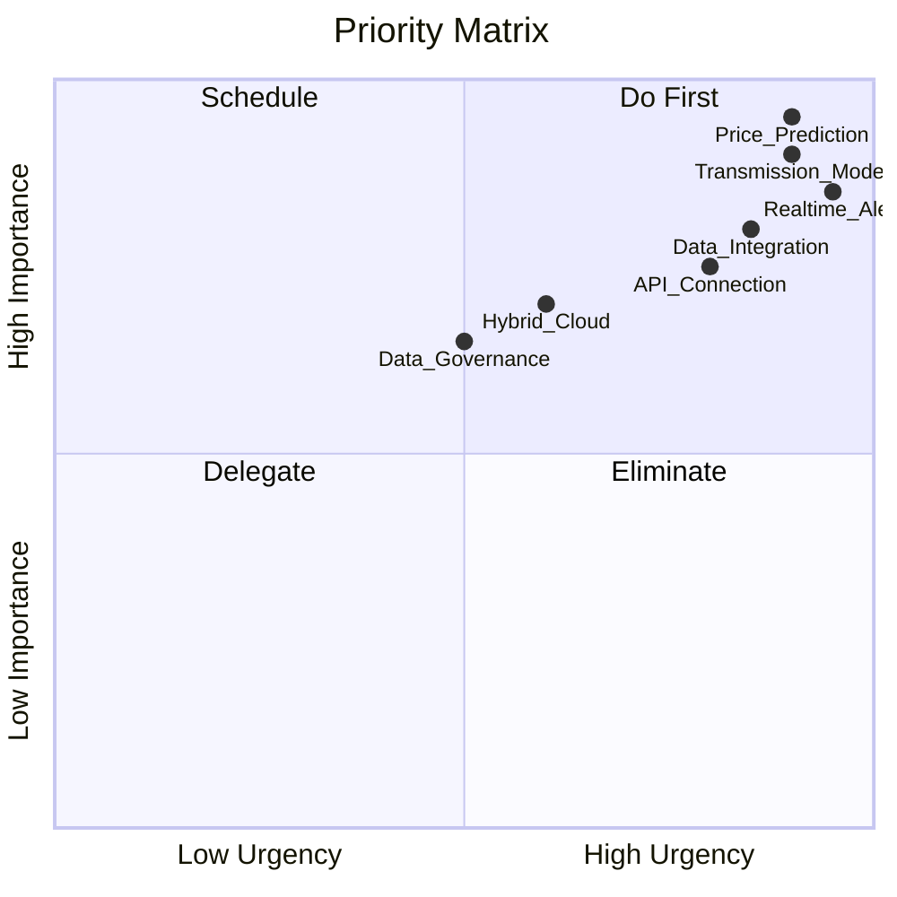
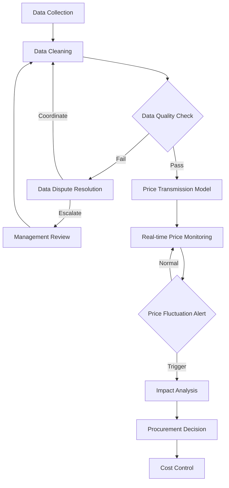
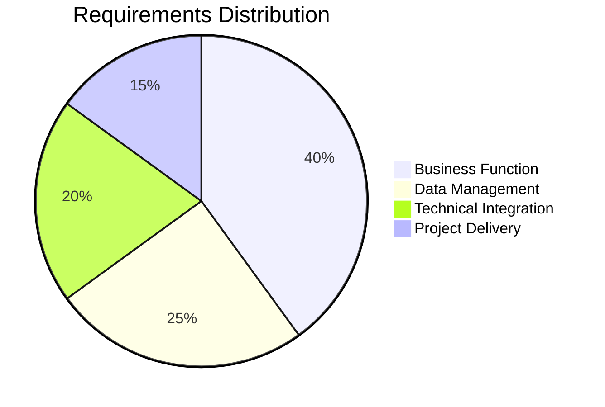
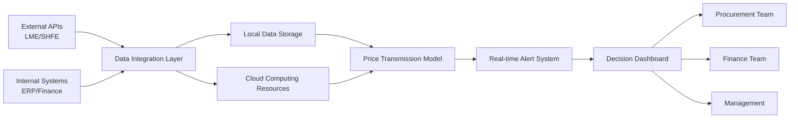

# 新能源行业趋势分析调研需求报告

## 1. 调研概述

### 1.1 基本信息
- **调研主题**: 新能源行业趋势分析调研
- **调研日期**: 2024年
- **调研方式**: 深度访谈
- **参与方**: 企业决策层及跨部门核心团队

### 1.2 调研背景
随着全球能源转型加速，新能源行业正经历快速发展期，但产业链上下游信息不透明问题日益凸显。企业在原材料采购决策中面临价格波动剧烈、成本控制困难等挑战。本次调研旨在明确企业在新能源趋势分析系统建设方面的核心需求，特别是在上游原材料价格波动预测和价格传导机制建模方面的具体要求。

---

## 2. 需求摘要

### 2.1 核心需求列表

| 需求编号 | 需求类别 | 需求描述 | 优先级 |
|---------|---------|---------|--------|
| REQ-001 | 业务功能 | 上游原材料（锂矿、硅料）价格波动预测 | P0 |
| REQ-002 | 业务功能 | 价格传导机制模型建立 | P0 |
| REQ-003 | 数据管理 | 多源数据收集与清洗（采购、成本、库存） | P0 |
| REQ-004 | 技术集成 | 对接主流大宗商品交易所API（LME、上期所） | P0 |
| REQ-005 | 性能要求 | 实时价格波动预警（秒级响应） | P0 |
| REQ-006 | 架构设计 | 混合云架构（本地核心数据+云端计算） | P1 |
| REQ-007 | 数据治理 | 跨部门数据争议升级与治理机制 | P1 |
| REQ-008 | 项目交付 | 3个月内完成MVP核心功能 | P0 |

### 2.2 优先级矩阵

**图表说明：**
- **Do First（立即执行）**: Price_Prediction（价格预测）、Transmission_Model（传导模型）、Realtime_Alert（实时预警）
- **Schedule（计划安排）**: Data_Integration（数据整合）、API_Connection（API对接）、Hybrid_Cloud（混合云架构）
- **Delegate（委托执行）**: Data_Governance（数据治理）

---

## 3. 详细需求分析

### 3.1 客户/用户需求

#### 3.1.1 核心痛点
**痛点1：产业链信息不透明**
- 上下游信息流通不畅，难以及时获取关键市场动态
- 供应链各环节数据孤岛现象严重

**痛点2：供需匹配效率低**
- 缺乏有效的市场分析工具
- 采购决策依赖人工经验，缺乏数据支撑

**痛点3：原材料价格波动风险高**
- 锂矿、硅料等关键原材料价格波动剧烈
- 价格传导机制不清晰，影响下游产品定价决策

#### 3.1.2 期望价值
- **核心期望**：建立价格传导机制模型，评估成本变化对下游产品定价的影响
- **业务目标**：提升采购决策科学性，实现成本精细化控制
- **经济效益**：降低因价格波动导致的成本风险

#### 3.1.3 关键场景
**场景：上游原材料价格波动应对**
- **触发条件**：原材料价格异常波动（超过预设阈值）
- **业务流程**：实时监测 → 预警触发 → 价格传导分析 → 采购决策调整
- **预期结果**：提前预测价格走势，优化采购时机和采购量

#### 3.1.4 涉及角色
- **采购部门**：提供采购数据，执行采购决策
- **财务部门**：提供成本数据，评估财务影响
- **技术团队**：负责数据整合、清洗和系统开发（5人以上全职投入）
- **管理层/数据治理委员会**：处理跨部门数据争议，制定数据治理策略

### 3.2 业务流程

#### 3.2.1 关键业务流程图

**流程说明：**
1. **数据收集（Data Collection）**：采购部、财务部提供原始数据
2. **数据清洗（Data Cleaning）**：技术团队进行数据整合与清洗
3. **数据质量检查（Data Quality Check）**：验证数据完整性和一致性
4. **数据争议处理（Data Dispute Resolution）**：跨部门协调或升级至管理层
5. **价格传导模型（Price Transmission Model）**：建立成本与定价关联模型
6. **实时价格监测（Real-time Price Monitoring）**：对接交易所API进行秒级监测
7. **价格波动预警（Price Fluctuation Alert）**：触发阈值时发出预警
8. **影响分析（Impact Analysis）**：评估对下游产品定价的影响
9. **采购决策（Procurement Decision）**：调整采购策略
10. **成本控制（Cost Control）**：实现成本优化目标

#### 3.2.2 关键决策节点
1. **数据质量判定**：决定数据是否可用于建模
2. **争议升级判断**：决定是否需要管理层介入
3. **预警阈值触发**：决定是否启动应急响应
4. **采购策略调整**：决定采购时机、数量和供应商选择

### 3.3 技术约束

#### 3.3.1 部署架构
**混合云架构方案**
- **本地存储**：核心业务数据（采购数据、成本数据、商业机密）
- **云端计算**：弹性扩展的计算资源，用于大规模数据分析和模型训练
- **数据同步**：建立安全的数据同步机制

#### 3.3.2 性能要求
- **实时性**：秒级响应（<3秒），支持价格波动即时预警
- **并发能力**：支持多部门同时访问和查询
- **可用性**：系统可用性≥99.5%

#### 3.3.3 系统集成
**外部系统对接**
- 伦敦金属交易所（LME）API
- 上海期货交易所（上期所）API
- 其他主流大宗商品交易所接口

**内部系统集成**
- 采购管理系统
- 财务管理系统
- ERP系统

#### 3.3.4 安全要求
- 核心数据本地化存储，确保数据主权
- 跨云数据传输加密
- 访问权限分级管理

### 3.4 项目约束

#### 3.4.1 预算约束
- **总预算范围**：50-150万元
- **预算覆盖**：标准版本开发、主流交易所API对接、基础设施部署
- **预算分配建议**：
  - 软件开发：40-60%
  - 基础设施：20-30%
  - API对接与数据购买：15-20%
  - 测试与运维：10-15%

#### 3.4.2 时间约束
- **交付周期**：3个月
- **交付策略**：快速MVP验证，核心功能优先
- **里程碑**：
  - Month 1：数据收集与清洗模块、基础架构搭建
  - Month 2：价格传导模型开发、交易所API对接
  - Month 3：实时预警功能、系统集成与测试

#### 3.4.3 资源约束
**团队资源（充足）**
- 技术开发团队：5人以上全职投入
- 角色配置建议：
  - 项目经理：1人
  - 后端开发：2人
  - 数据工程师：1人
  - 算法工程师：1人
  - 测试工程师：1人（兼职）

**其他资源**
- 需协调采购部门和财务部门配合数据提供
- 需管理层支持数据治理机制建立

---

## 4. 可视化分析

### 4.1 需求分类分布

**分布说明：**
- **业务功能（40%）**：价格预测、传导模型、预警机制
- **数据管理（25%）**：数据收集、清洗、治理
- **技术集成（20%）**：API对接、系统集成
- **项目交付（15%）**：时间、预算、资源管理

### 4.2 系统架构概览

**架构说明：**
- 数据从外部API和内部系统汇集到数据集成层
- 核心数据本地存储，计算资源云端弹性扩展
- 价格传导模型基于混合数据进行分析
- 实时预警系统向各业务部门推送决策信息

---

## 5. 方案建议

### 5.1 MVP核心功能范围
基于3个月交付和50-150万预算约束，建议MVP版本聚焦以下核心功能：

**Phase 1：数据基础（Month 1）**
1. 建立跨部门数据收集规范和流程
2. 开发数据清洗与质量检查模块
3. 搭建混合云基础架构（优先本地环境）

**Phase 2：核心模型（Month 2）**
1. 对接2-3个主流交易所API（LME、上期所优先）
2. 开发价格传导机制模型（简化版）
3. 实现基础价格波动监测功能

**Phase 3：预警与集成（Month 3）**
1. 实现实时价格波动预警（秒级响应）
2. 开发决策支持仪表板
3. 完成系统集成测试与上线

### 5.2 技术架构建议

**架构选型**
- **后端框架**：Python（Django/Flask）+ FastAPI（实时API）
- **数据处理**：Apache Kafka（实时数据流）+ Pandas/Spark
- **模型开发**：Scikit-learn/Prophet（时间序列预测）
- **数据库**：PostgreSQL（本地）+ Redis（缓存）
- **云平台**：阿里云/腾讯云（计算资源）
- **监控预警**：Prometheus + Grafana

### 5.3 数据治理机制建议

**建立三级数据争议处理机制**
1. **一级：部门协调**（2工作日内解决）
   - 技术团队主导跨部门数据核对
   - 采用标准化数据质量评估表

2. **二级：数据治理委员会**（5工作日内解决）
   - 由各部门负责人组成
   - 制定数据标准和质量规范

3. **三级：管理层裁决**（特殊情况）
   - 涉及重大业务决策的数据争议
   - 管理层最终裁定

### 5.4 成本优化建议

**在预算范围内最大化价值**
1. **API对接**：优先对接2-3个核心交易所，其他交易所根据业务需

---

## 附录：完整访谈记录

> 本次调研共收集了 12 个问题的回答

### Q1: 在新能源行业趋势分析中，您最希望解决的核心痛点是什么？

**回答**: 产业链上下游信息不透明，供需匹配效率低

**维度**: 客户需求

*记录时间: 2026-01-23T14:08:49Z*

---

### Q2: 基于您提到的产业链信息不透明和供需匹配效率低的痛点，您最希望通过趋势分析解决哪个具体场景下的问题？

**回答**: 上游原材料（如锂矿、硅料）价格波动预测，帮助采购决策和成本控制

**维度**: 客户需求

*记录时间: 2026-01-23T14:22:09Z*

---

### Q3: 在上游原材料价格波动预测这个场景中，您作为决策者最关心的是哪个方面的价值实现？

**回答**: 建立价格传导机制模型，评估成本变化对下游产品定价的影响

**维度**: 客户需求

*记录时间: 2026-01-23T14:22:23Z*

---

### Q4: 在建立价格传导机制模型的业务流程中，您认为最关键的流程节点是什么？

**回答**: 数据收集与清洗（原材料价格、供需量、库存等关键指标）

**维度**: 业务流程

*记录时间: 2026-01-23T14:22:33Z*

---

### Q5: 在数据收集与清洗这个关键流程中，您的团队通常是如何分工的？具体涉及哪些角色？

**回答**: 跨部门协作：采购部提供采购数据，财务部提供成本数据，技术团队负责整合清洗

**维度**: 业务流程

*记录时间: 2026-01-23T14:22:51Z*

---

### Q6: 在跨部门协作进行数据收集与清洗的过程中，当出现数据质量问题或部门间数据不一致时，您的团队通常采用什么样的异常处理机制？

**回答**: 建立数据争议升级机制，无法协调时上报管理层或成立专门的数据治理委员会处理

**维度**: 业务流程

*记录时间: 2026-01-23T14:23:10Z*

---

### Q7: 基于您提到的跨部门数据协作和价格传导机制模型需求，您希望这个新能源趋势分析系统采用什么样的部署方式？

**回答**: 混合云架构，核心数据本地存储，计算资源云端弹性扩展

**维度**: 技术约束

*记录时间: 2026-01-23T14:23:40Z*

---

### Q8: 基于您选择的混合云架构，在系统性能方面，您对数据处理和分析的响应时间有什么具体要求？

**回答**: 实时响应（秒级）- 价格波动预警需要即时触发

**维度**: 技术约束

*记录时间: 2026-01-23T14:23:53Z*

---

### Q9: 在实时价格波动预警的技术实现中，您希望系统与哪些外部数据源或系统进行集成？

**回答**: 主流大宗商品交易所API（如LME、上期所等）

**维度**: 技术约束

*记录时间: 2026-01-26T07:53:14Z*

---

### Q10: 考虑到您需要建立实时价格传导机制模型并对接多个交易所API，这个新能源趋势分析系统项目的预算范围是多少？

**回答**: 50-150万元（标准版本，含主流交易所对接）

**维度**: 项目约束

*记录时间: 2026-01-26T08:22:50Z*

---

### Q11: 考虑到50-150万的预算和实时价格预警的复杂度，您期望这个新能源趋势分析系统的上线时间节点是？

**回答**: 3个月内（快速MVP验证，核心功能优先）

**维度**: 项目约束

*记录时间: 2026-01-26T08:23:03Z*

---

### Q12: 在3个月快速MVP交付和50-150万预算约束下，您的团队在以下哪个方面的资源支持最充足？

**回答**: 技术开发团队（5人以上全职投入）

**维度**: 项目约束

*记录时间: 2026-01-26T08:23:15Z*

---

