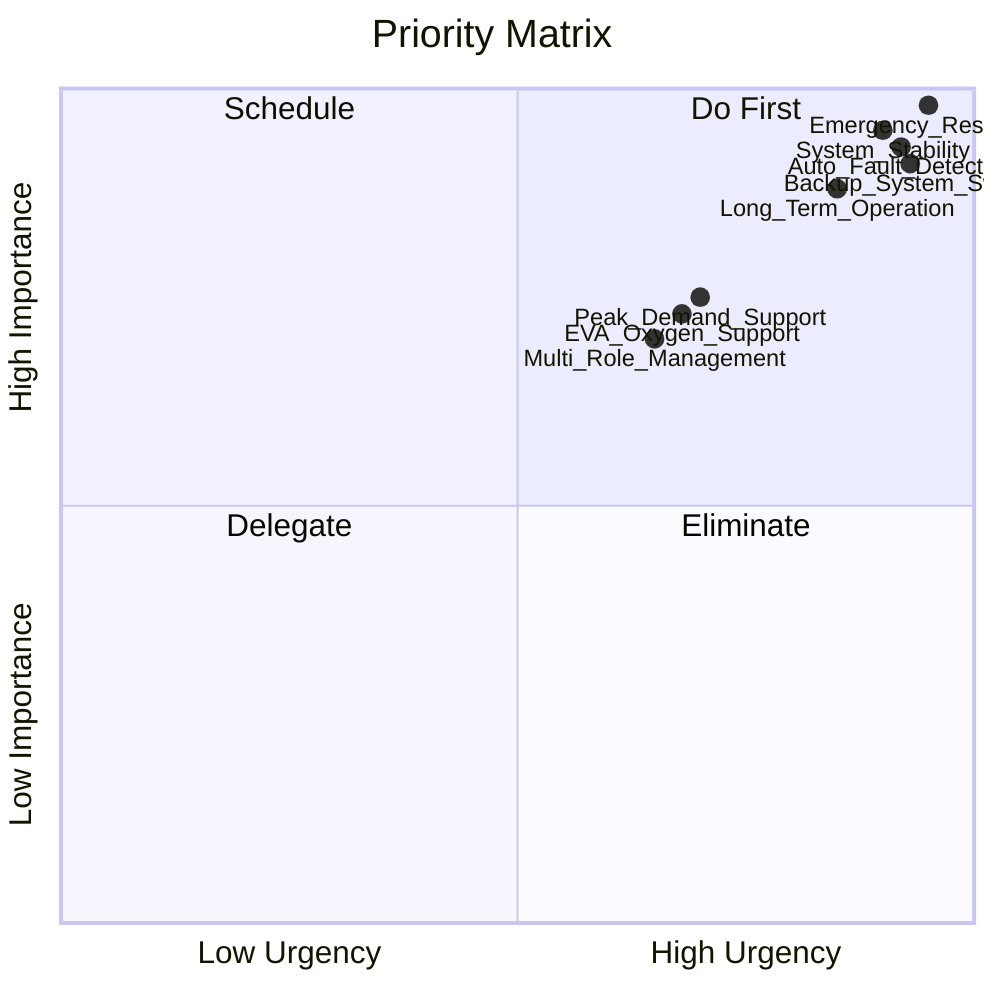
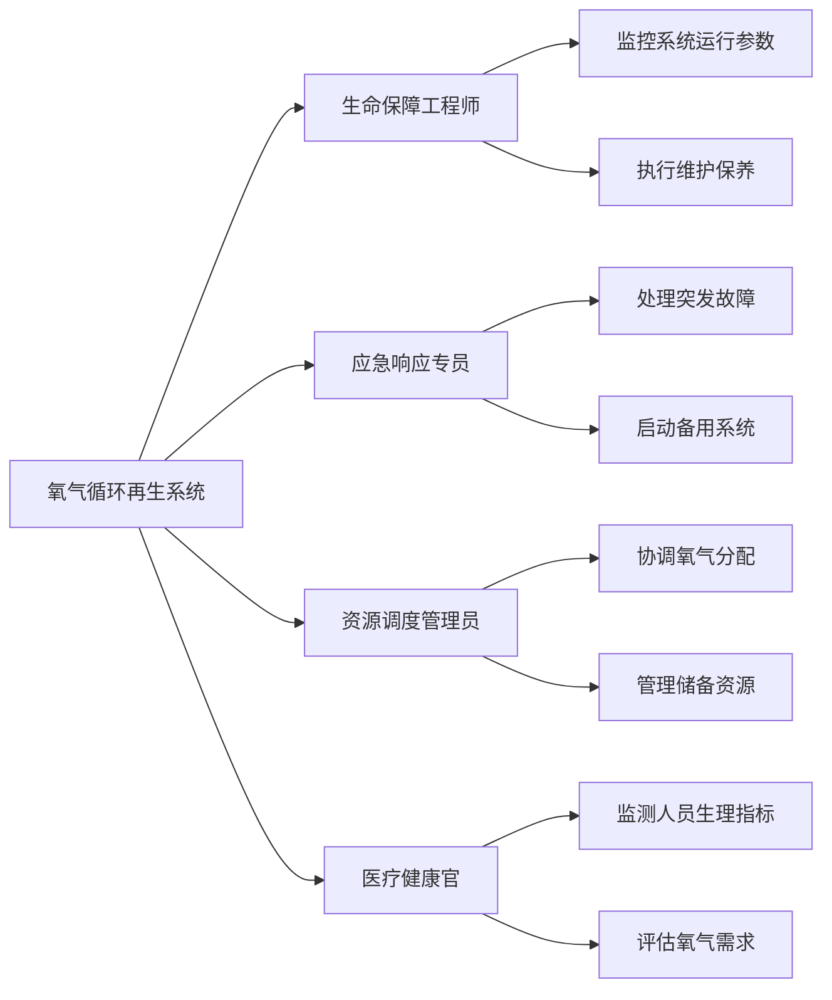
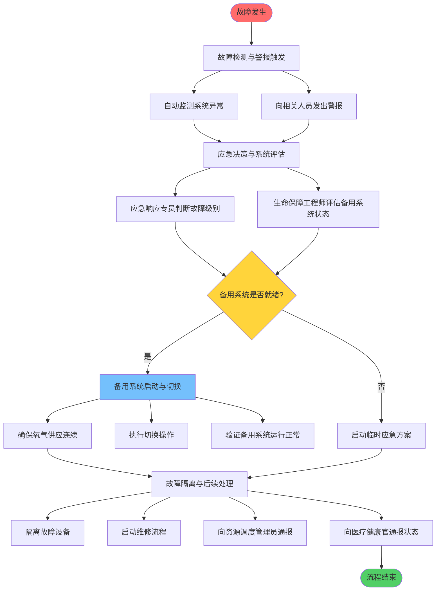
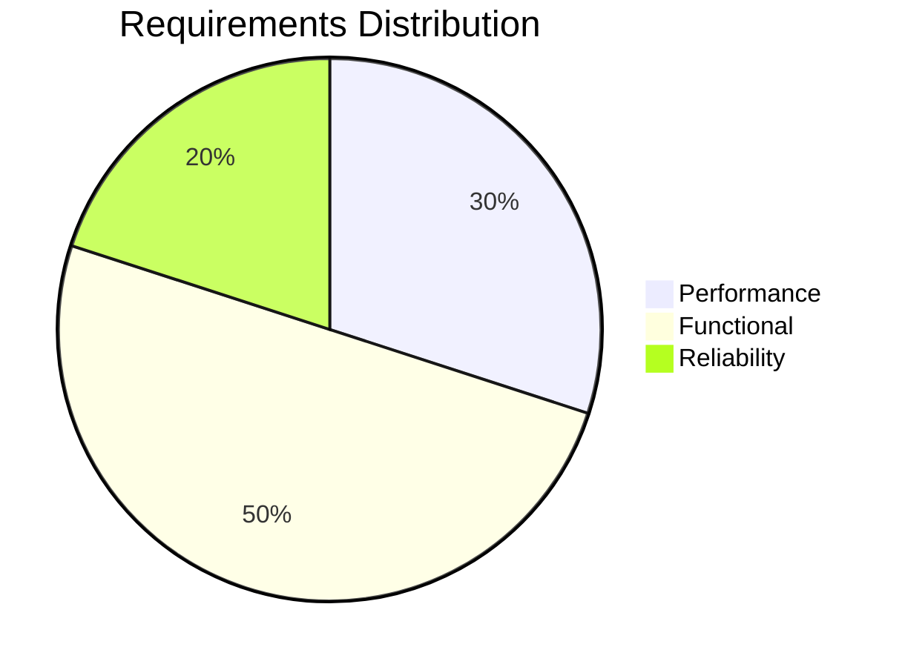
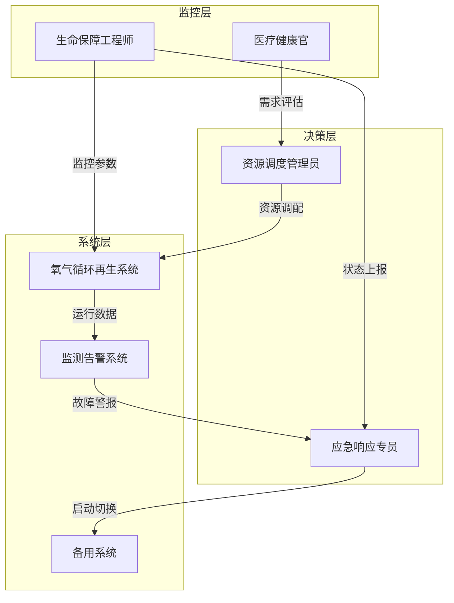

# 月球移民计划需求调研报告

---

## 1. 调研概述

### 1.1 基本信息
- **调研主题**：月球移民计划
- **调研时间**：2024年
- **调研方法**：结构化访谈
- **参与对象**：月球移民计划相关业务方

### 1.2 调研背景
月球移民计划是一项前沿的航天工程项目,旨在建立可持续的月球基地以支持长期人类居住。本次调研聚焦于月球基地的生命支持系统,特别是氧气循环再生系统的设计与运维需求。通过深入访谈,我们识别了系统设计的核心挑战、关键使用场景、业务流程以及应急响应要求,为后续的系统架构设计提供决策依据。

---

## 2. 需求摘要

### 2.1 核心需求列表

| 需求编号 | 需求类别 | 需求描述 | 优先级 |
|---------|---------|---------|--------|
| REQ-001 | 功能性 | 氧气循环再生系统的稳定性与高效运行 | P0 |
| REQ-002 | 性能 | 应急响应时间≤30秒（故障切换备用系统） | P0 |
| REQ-003 | 功能性 | 支持长期持续供氧（数月至数年不间断运行） | P0 |
| REQ-004 | 功能性 | 舱外作业移动供氧保障能力 | P1 |
| REQ-005 | 功能性 | 峰值需求应对能力（新移民到达时） | P1 |
| REQ-006 | 功能性 | 自动故障检测与警报系统 | P0 |
| REQ-007 | 功能性 | 备用系统自动/手动切换能力 | P0 |
| REQ-008 | 功能性 | 多角色协同的运维管理系统 | P1 |

### 2.2 优先级矩阵

**说明：**
- **Do First（立即执行）**：应急响应系统(Emergency_Response)、系统稳定性(System_Stability)、自动故障检测(Auto_Fault_Detection)、备用系统切换(Backup_System_Switch)
- **Schedule（计划执行）**：长期运行保障(Long_Term_Operation)、峰值需求支持(Peak_Demand_Support)、舱外供氧支持(EVA_Oxygen_Support)、多角色管理(Multi_Role_Management)

---

## 3. 详细需求分析

### 3.1 客户/用户需求

#### 3.1.1 核心痛点
月球移民计划面临的最核心挑战是**生命支持系统的可靠性与资源供给**问题,具体包括：
- 氧气供应的持续性和稳定性
- 水资源的循环利用
- 食物的储备与生产

在多种资源中,**氧气循环再生系统的稳定性与效率**被确认为最优先需要解决的问题,因为氧气直接关系到人员生存,容错空间极小。

#### 3.1.2 关键使用场景

根据访谈,系统需要应对以下四大核心场景：

| 场景 | 描述 | 稳定性要求 | 特殊需求 |
|------|------|-----------|---------|
| **紧急故障响应** | 设备故障时的备用系统切换 | 极高 | ≤30秒响应时间 |
| **长期持续供氧** | 数月至数年的不间断运行 | 极高 | 高可靠性、低维护频率 |
| **舱外作业保障** | 移动供氧设备支持 | 高 | 轻量化、便携性 |
| **峰值需求应对** | 新移民到达时的需求激增 | 中高 | 弹性扩容能力 |

#### 3.1.3 关键角色与职责

系统运维涉及四个核心角色：

**角色详细说明：**
1. **生命保障工程师**：技术运维核心,负责系统监控和日常维护
2. **应急响应专员**：危机处理第一责任人,执行故障决策
3. **资源调度管理员**：资源协调中枢,平衡供需关系
4. **医疗健康官**：需求侧监测,确保供氧符合健康标准

### 3.2 业务流程

#### 3.2.1 应急响应流程

系统最关键的业务流程是**设备故障时的应急响应与备用系统切换**,完整流程包括四个阶段：

**关键性能指标（KPI）：**
- **响应时间要求**：从故障检测到备用系统完全接管供氧 ≤ 30秒
- **目标结果**：确保人员无感知切换,生命安全不受威胁

#### 3.2.2 决策节点分析

| 决策点 | 决策者 | 决策依据 | 时间要求 |
|--------|--------|---------|---------|
| 故障级别判断 | 应急响应专员 | 系统监测数据、历史故障记录 | 5秒内 |
| 备用系统评估 | 生命保障工程师 | 备用系统健康状态、资源储备 | 10秒内 |
| 切换执行确认 | 应急响应专员 | 评估结果、人员安全状态 | 5秒内 |
| 维修优先级 | 资源调度管理员 | 设备重要性、资源可用性 | 30分钟内 |

### 3.3 技术约束

**注**：本次访谈未收集到具体技术约束信息,建议在后续调研中补充以下内容：
- 月球环境适应性要求（温度、辐射、真空）
- 系统部署架构约束
- 与其他生命支持系统的接口标准
- 数据传输与地球通信延迟
- 能源供应限制

### 3.4 项目约束

**注**：本次访谈未收集到项目约束信息,建议在后续调研中补充以下内容：
- 项目预算范围
- 实施时间表与里程碑
- 人力资源配置
- 测试与验证周期
- 供应链与物流限制

---

## 4. 可视化分析

### 4.1 需求分类分布

**说明：**
- **性能需求（30%）**：应急响应时间、系统吞吐量
- **功能需求（50%）**：氧气再生、故障检测、系统切换、多场景支持
- **可靠性需求（20%）**：长期运行稳定性、容错能力

### 4.2 角色交互关系

---

## 5. 方案建议

基于需求分析,提出以下解决方案建议：

### 5.1 系统架构建议

#### 5.1.1 双冗余架构设计
- **主系统**：高效率氧气电解与CO2转化系统
- **备用系统**：独立供电、独立控制的备份系统
- **储备系统**：应急氧气罐（支持72小时以上）

#### 5.1.2 智能监控与预警
- 实时监测系统运行参数（压力、流量、纯度、温度）
- AI预测性维护,提前识别潜在故障
- 多级告警机制（预警、警告、危急）
- 自动触发应急预案

### 5.2 应急响应优化

#### 5.2.1 自动化切换机制
- **0-10秒**：系统自动检测异常并启动备用系统预热
- **10-20秒**：备用系统达到工作状态,执行自动切换
- **20-30秒**：验证切换成功,通知相关人员

#### 5.2.2 人机协同决策
- 关键决策点保留人工确认机制
- 提供决策支持信息（故障诊断、影响评估）
- 紧急情况下支持手动强制切换

### 5.3 长期运行保障

#### 5.3.1 模块化维护设计
- 关键部件采用模块化设计,支持在线更换
- 建立定期维护计划（日检、周检、月检）
- 备品备件充足储备

#### 5.3.2 性能降级策略
- 定义多级运行模式（正常、节能、应急）
- 根据人员数量动态调整产能
- 峰值需求时启动增压模式

### 5.4 多场景适配

| 场景 | 解决方案 | 实施优先级 |
|------|---------|-----------|
| 舱外作业 | 便携式氧气背包（6-8小时续航） | P1 |
| 新移民到达 | 弹性扩容机制（快速启动辅助模块） | P1 |
| 长期居住 | 高效催化剂技术（延长设备寿命） | P0 |
| 紧急故障 | 三重备份体系（主+备+储备） | P0 |

### 5.5 协同管理平台

开发统一的**生命保障管理系统（LSMS）**,支持：
- 实时数据可视化仪表盘
- 角色权限管理与工作流引擎
- 移动端APP（支持离线操作）
- 应急指挥调度功能
- 历史数据分析与报

---

## 附录：完整访谈记录

> 本次调研共收集了 6 个问题的回答

### Q1: 在月球移民计划中，您认为最核心的痛点或挑战是什么？

**回答**: 生命支持系统的可靠性与资源供给（氧气、水、食物）

**维度**: 客户需求

*记录时间: 2026-01-26T11:07:29Z*

---

### Q2: 在月球移民的生命支持系统中，您最期望优先解决哪个方面的资源供给问题？

**回答**: 氧气循环再生系统的稳定性与效率

**维度**: 客户需求

*记录时间: 2026-01-26T11:07:42Z*

---

### Q3: 在月球基地的氧气循环再生系统中，您认为哪些使用场景对系统稳定性要求最高？

**回答**: 紧急状况下的快速响应（如设备故障时的备用系统切换）；长期居住期间的持续供氧（数月至数年的不间断运行）；舱外作业时的移动供氧保障；新移民到达时的峰值需求应对

**维度**: 客户需求

*记录时间: 2026-01-26T11:07:58Z*

---

### Q4: 在月球基地氧气循环再生系统的日常运维流程中，涉及哪些关键角色及其职责分工？

**回答**: 医疗健康官（监测人员生理指标、评估氧气需求）；资源调度管理员（协调氧气分配、管理储备资源）；应急响应专员（处理突发故障、启动备用系统）；生命保障工程师（监控系统运行参数、执行维护保养）

**维度**: 业务流程

*记录时间: 2026-01-26T11:08:11Z*

---

### Q5: 在月球基地氧气循环再生系统的运维中，当发生设备故障需要切换备用系统时，完整的应急响应流程包括哪些关键环节？

**回答**: 故障检测与警报触发（自动监测系统异常并向相关人员发出警报）；应急决策与系统评估（应急响应专员判断故障级别、生命保障工程师评估备用系统状态）；备用系统启动与切换确认（执行切换操作、验证备用系统运行正常、确保氧气供应连续）；故障隔离与后续处理（隔离故障设备、启动维修流程、向资源调度管理员和医疗健康官通报状态）

**维度**: 业务流程

*记录时间: 2026-01-26T11:08:24Z*

---

### Q6: 在月球基地氧气循环再生系统的应急响应流程中，从故障检测警报触发到备用系统完全接管供氧，您认为可接受的最长响应时间是多少？

**回答**: 30秒以内（确保人员无感知切换）

**维度**: 业务流程

*记录时间: 2026-01-26T11:08:38Z*

---

