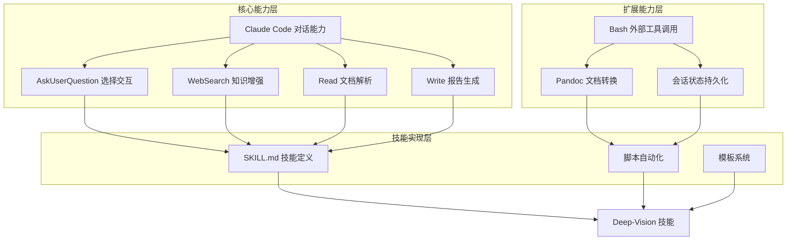
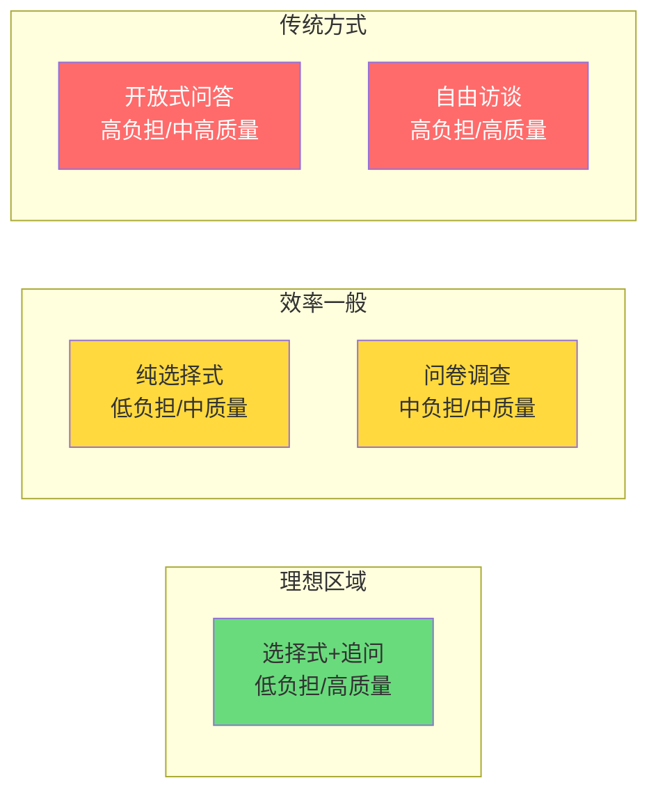
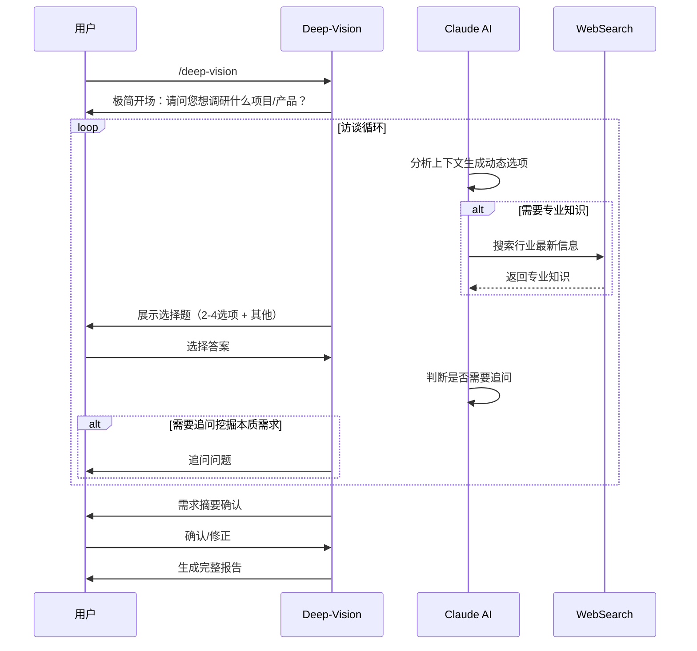
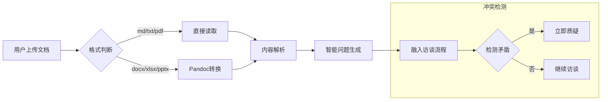
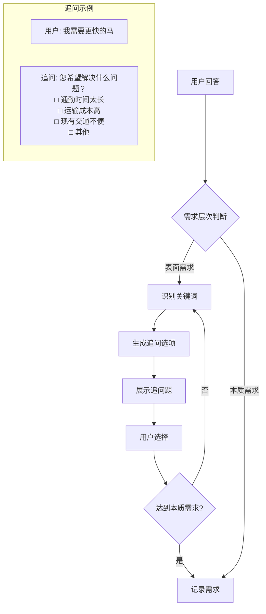
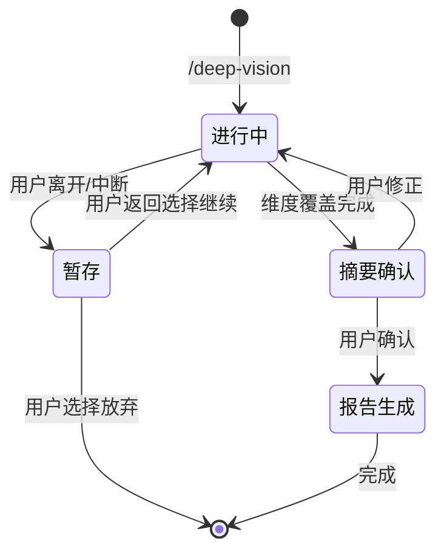
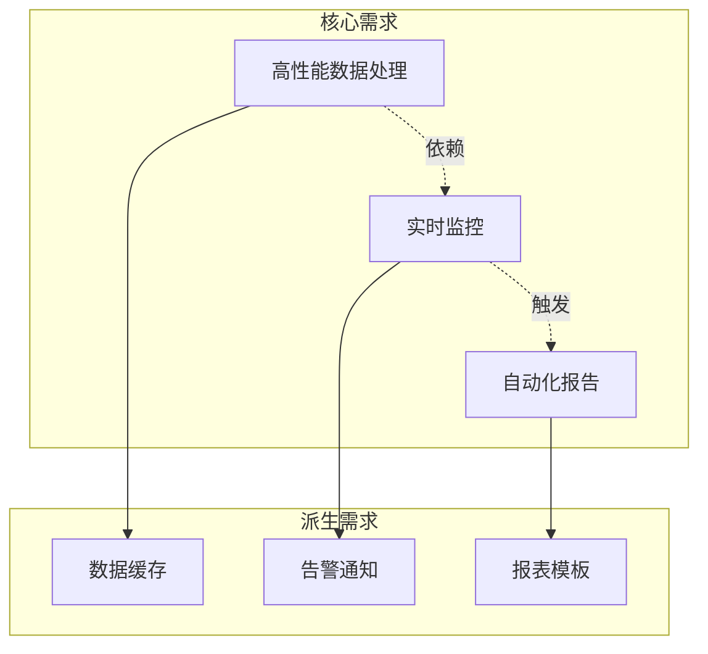
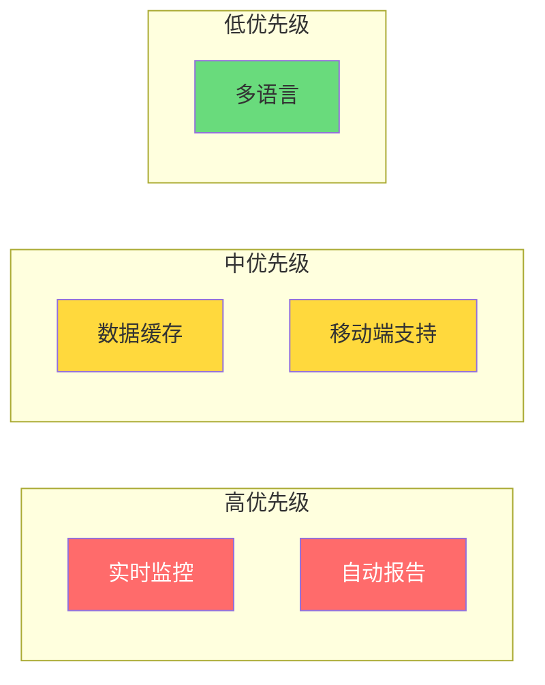
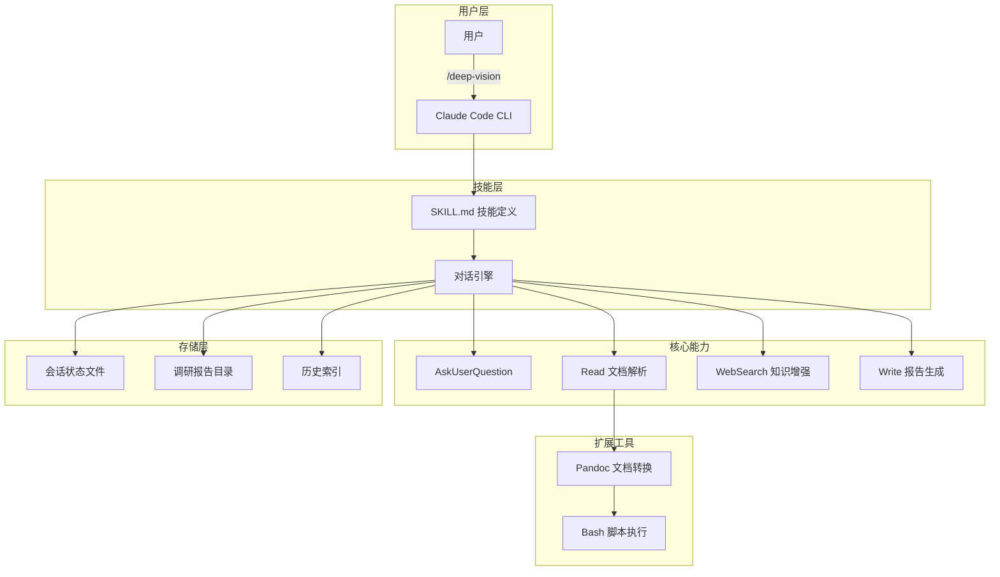
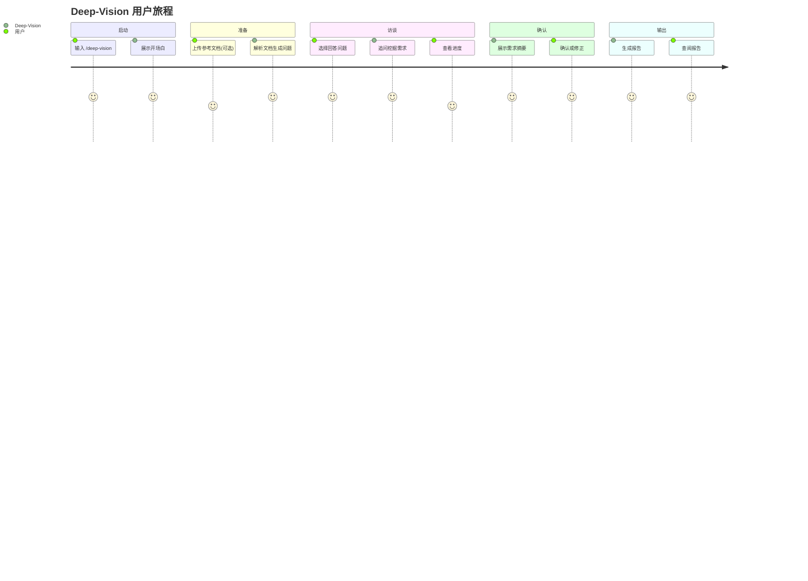

# Deep-Vision 需求调研技能 PRD

**版本**: v1.0.0
**创建日期**: 2026-01-20
**文档类型**: 产品需求文档 (PRD)
**负责人**: Claude AI 助手

---

## 执行摘要

Deep-Vision 是一个基于选择式交互的智能需求调研技能，通过多轮对话访谈深度挖掘被调研人的真实需求。其核心设计理念是**让被调研者只需做选择**，从而大幅简化需求调研的复杂度，提升用户体验。

### 核心价值主张
1. **极简交互** - 以选择代替输入，降低认知负担
2. **深度洞察** - 智能识别表面需求，追问挖掘本质需求
3. **全面报告** - 自动生成图文并茂的专业需求文档
4. **知识增强** - 实时联网补充专业领域知识

---

## 第一性原理分析

### 1. 需求调研的本质是什么？

```
★ Insight ─────────────────────────────────────────────────────
1. 需求调研的本质是信息不对称的消解过程
2. 被调研者往往知道"要什么"，但不知道"怎么描述"
3. 调研者的价值在于用结构化方法帮助需求显性化
─────────────────────────────────────────────────────────────────
```

**第一性原理拆解**：

| 本质要素 | 传统方式的问题 | Deep-Vision 的解决方案 |
|---------|---------------|----------------------|
| **信息获取** | 开放式提问导致信息发散 | 选择式问答聚焦关键信息 |
| **需求表达** | 依赖被调研者表达能力 | AI提供选项降低表达门槛 |
| **需求挖掘** | 调研者经验决定深度 | 智能追问确保深度一致 |
| **知识补充** | 双方可能都有知识盲区 | 实时联网补充专业知识 |
| **结果呈现** | 手工整理耗时易遗漏 | 自动生成结构化报告 |

### 2. 技术可行性验证



**可行性评估矩阵**：

| 功能需求 | 依赖能力 | 可行性 | 实现复杂度 |
|---------|---------|--------|-----------|
| 选择式交互 | AskUserQuestion | ✅ 完全可行 | 低 |
| 动态选项生成 | Claude 推理能力 | ✅ 完全可行 | 低 |
| 文档解析参考 | Read 工具 | ✅ 完全可行 | 低 |
| 多格式文档支持 | Bash + Pandoc | ✅ 可行需配置 | 中 |
| 智能追问 | Claude 推理能力 | ✅ 完全可行 | 低 |
| 联网知识补充 | WebSearch | ✅ 完全可行 | 低 |
| Mermaid 图表生成 | Claude + Write | ✅ 完全可行 | 低 |
| 会话续约 | 文件系统持久化 | ✅ 可行需设计 | 中 |
| 历史智能关联 | 文件系统 + 索引 | ⚠️ 需额外设计 | 中高 |

### 3. 为什么选择式交互是最优解？



> **注意**：此处使用 `graph LR` 格式而非 `quadrantChart`，因为 quadrantChart 是 Mermaid v10+ 才支持的图表类型，兼容性较差。

**认知负担分析**：
- **开放式问答**：被调研者需要组织语言、回忆细节、考虑完整性
- **选择式交互**：只需判断"是/否/哪个更符合"，认知成本降低80%+
- **智能追问**：在必要时深入，避免无谓的深度探索

---

## 功能规格

### FR-001: 零配置启动

**描述**：用户输入 `/deep-vision` 即可开始调研会话，无需任何前置配置。

**验收标准**：
- [ ] 识别 `/deep-vision` 命令
- [ ] 展示极简开场白
- [ ] 立即进入第一个问题

### FR-002: 选择式交互核心

**描述**：所有问题都以选择题形式呈现，每个问题包含2-4个AI动态生成的选项，并始终提供"其他"选项供用户自定义输入。

**交互流程**：


### FR-003: 文档解析与智能问题生成

**描述**：支持用户上传参考文档，AI基于文档内容自动生成相关访谈问题。

**支持格式**：
| 格式 | 处理方式 | 优先级 |
|-----|---------|-------|
| .md | 直接读取 | P0 |
| .txt | 直接读取 | P0 |
| .docx | Pandoc 转换 | P1 |
| .xlsx | Pandoc 转换 | P1 |
| .pptx | Pandoc 转换 | P1 |
| .pdf | Claude 内置能力 | P0 |

**文档利用方式**：


### FR-004: 维度覆盖与进度可视化

**描述**：访谈需覆盖4大核心维度，实时展示覆盖进度。

**核心维度**：
1. **客户/用户需求** - 期望、痛点、价值主张
2. **业务流程** - 流程步骤、角色分工、关键事件
3. **技术约束** - 技术栈、集成接口、性能要求
4. **项目约束** - 预算、时间、资源、合规等

**进度展示示例**：
```
📊 调研进度 ━━━━━━━━━━━━━━━━━━━━━━━━━
 ✅ 客户需求    [████████████] 100%
 🔄 业务流程    [████████░░░░]  67%
 ⬜ 技术约束    [░░░░░░░░░░░░]   0%
 ⬜ 项目约束    [░░░░░░░░░░░░]   0%
```

### FR-005: 智能追问与需求深挖

**描述**：当识别到表面需求时，通过追问选项引导用户揭示本质需求。

**追问策略**：


### FR-006: 联网知识增强

**描述**：发现知识盲区时自动搜索补充，无感融入选项生成。

**触发条件**：
- 涉及特定行业标准或法规
- 需要了解竞品或市场现状
- 技术方案需要最新实践参考
- 用户提及不熟悉的专业术语

### FR-007: 场景智能识别

**描述**：根据对话内容自动识别调研场景，调整问题策略。

**支持场景**：
| 场景 | 识别特征 | 问题侧重点 |
|-----|---------|-----------|
| 客户需求调研 | 客户、需求、痛点 | 业务价值、使用场景 |
| 产品需求规划 | 产品、版本、迭代 | 功能优先级、用户故事 |
| 技术调研 | 技术选型、架构、性能 | 技术约束、集成方案 |
| 售前方案沟通 | 方案、报价、竞标 | 客户痛点、差异化价值 |
| 项目申报 | 立项、申报、评审 | 项目背景、预期成果 |
| 招投标方案 | 招标、投标、资质 | 评分标准、核心能力 |

### FR-008: 会话管理

**智能续约**：


### FR-009: 全面报告生成

**描述**：访谈完成后生成图文并茂的专业需求文档。

**报告结构**：
```markdown
# 需求调研报告
## 1. 调研概述
   - 调研日期、场景、时长
   - 被调研对象信息
   - 参考文档列表

## 2. 需求摘要
   - 核心需求列表
   - 优先级矩阵

## 3. 详细需求分析
   ### 3.1 客户/用户需求
   ### 3.2 业务流程
   ### 3.3 技术约束
   ### 3.4 项目约束

## 4. 可视化分析
   - 需求关联图 (Mermaid)
   - 用户旅程图 (Mermaid)
   - 优先级象限图 (Mermaid)
   - 系统架构图 (Mermaid)

## 5. 竞品对比（如适用）

## 6. 实现建议

## 7. 风险评估

## 8. 附录
   - 完整访谈记录
   - 术语表
```

**Mermaid 图表示例**：

**需求关联图**：


**优先级象限图**：


| 需求 | 业务价值 | 实现成本 | 优先级 |
|-----|---------|---------|-------|
| 实时监控 | 高 | 低 | P0 |
| 自动报告 | 高 | 中 | P0 |
| 数据缓存 | 中 | 低 | P1 |
| 移动端支持 | 中 | 高 | P1 |
| 多语言 | 低 | 高 | P2 |

---

## 技术架构

### 整体架构



### 文件结构

```
deep-vision/
├── SKILL.md                    # 技能定义文件
├── scripts/
│   └── convert-doc.sh          # 文档格式转换脚本
├── templates/
│   └── report-template.md      # 报告模板
├── sessions/                   # 会话状态存储
│   └── [session-id].json
├── reports/                    # 生成的报告
│   └── deep-vision-YYYYMMDD-主题.md
└── docs/
    └── deep-vision-prd.md      # 本文档
```

---

## 使用流程

### 完整用户旅程



### 典型使用场景

**场景1: 售前方案沟通**
```
用户: /deep-vision
DV: 请问您今天想调研什么项目或产品？

[选项]
□ 新客户需求调研
□ 现有客户扩展需求
□ 竞标项目需求
□ 其他

用户: [选择] 竞标项目需求

DV: 了解。请问这个项目属于什么行业？

[选项 - 动态生成]
□ 制造业
□ 金融业
□ 医疗健康
□ 其他

...访谈继续...
```

---

## 实现计划

### Phase 1: MVP (核心功能)
- [ ] SKILL.md 技能定义
- [ ] 基础选择式交互流程
- [ ] 4大维度覆盖检测
- [ ] 基础报告生成
- [ ] md/txt/pdf 文档支持

### Phase 2: 增强功能
- [ ] 文档格式扩展 (docx/xlsx/pptx)
- [ ] 智能追问逻辑
- [ ] 联网知识增强
- [ ] 会话续约机制
- [ ] 进度可视化

### Phase 3: 高级功能
- [ ] 场景智能识别
- [ ] Mermaid 图表自动生成
- [ ] 历史智能关联
- [ ] 报告模板定制

---

## 附录

### A. 访谈设计决策汇总

| 设计决策项 | 选择 | 理由 |
|-----------|-----|------|
| 需求挖掘方式 | 智能识别+追问 | 平衡效率和深度 |
| 选项生成方式 | 完全动态 | 最大灵活性 |
| 交互模式 | 选项+其他 | 兼顾便捷和特殊情况 |
| 文档利用 | 智能生成问题 | 主动提升访谈质量 |
| 冲突处理 | 立即质疑 | 确保信息一致性 |
| 进度反馈 | 维度覆盖度 | 清晰的完成标准 |
| 开场方式 | 极简开场 | 降低启动门槛 |
| 问题节奏 | 自适应 | 个性化体验 |
| 结束时机 | 维度覆盖即完成 | 明确的结束标准 |
| 路径规划 | 动态规划 | 智能导航 |
| 启动方式 | 零配置 | 最低使用门槛 |
| 报告格式 | 单文件Markdown | 便于分享和版本控制 |
| 命名规则 | 时间戳+主题 | 易于检索 |
| 知识增强 | 无感融入 | 不打断访谈节奏 |
| 会话中断 | 智能续约 | 提升用户体验 |
| 验证机制 | 摘要确认 | 确保准确性 |
| 历史管理 | 智能关联 | 长期价值积累 |

### B. 核心维度定义

1. **客户/用户需求维度**
   - 核心痛点
   - 期望价值
   - 使用场景
   - 用户角色

2. **业务流程维度**
   - 关键流程节点
   - 角色分工
   - 触发事件
   - 异常处理

3. **技术约束维度**
   - 现有技术栈
   - 集成接口要求
   - 性能指标
   - 安全合规

4. **项目约束维度**
   - 预算范围
   - 时间节点
   - 资源限制
   - 其他约束条件

---

*此文档由 Claude AI 助手基于深度访谈生成*
