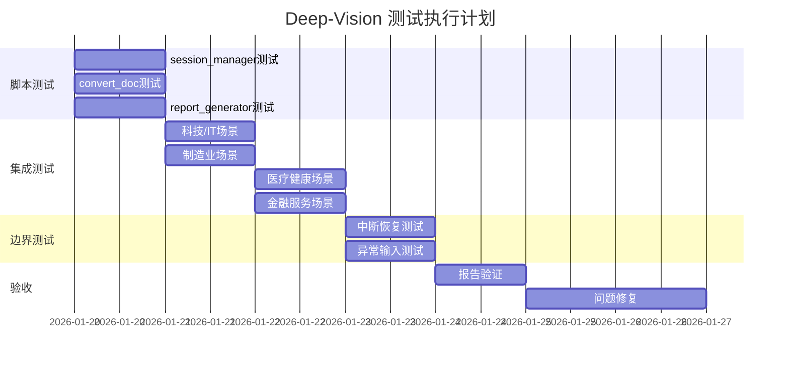

# Deep-Vision 技能测试方案

**版本**: v1.0.0
**创建日期**: 2026-01-20
**文档类型**: 测试方案

---

## 1. 测试目标与范围

### 1.1 测试目标

验证 deep-vision 智能需求调研技能在以下层面的正确性和质量：

| 层面 | 验证目标 |
|-----|---------|
| **交互体验层** | 选项生成质量、追问时机合理性、用户认知负担 |
| **数据完整性层** | 会话状态持久化、维度覆盖计算、报告内容准确性 |
| **边界与异常处理** | 中断恢复、格式兼容、错误提示友好度 |
| **端到端流程** | 从启动到报告生成的完整用户旅程 |

### 1.2 测试策略

采用**并行测试**策略：
- 脚本单元测试与整体集成测试同步推进
- 半自动化脚本模拟用户选择，验证脚本输出

### 1.3 验收标准

**质量达标**：选项相关性、追问合理性、报告质量均需达到预期水平

---

## 2. 测试用例设计

### 2.1 跨行业场景测试

#### TC-IND-001: 科技/IT 行业场景

```yaml
场景名称: 企业CRM系统需求调研
行业: 科技/IT
测试目的: 验证技能对IT领域专业术语和流程的理解

前置条件:
  - 无参考文档
  - 模拟售前方案沟通场景

测试步骤:
  1. 执行 /deep-vision CRM系统需求调研
  2. 选择"新客户需求调研"
  3. 在客户需求维度，验证选项是否包含IT行业常见痛点
  4. 在技术约束维度，验证选项是否涵盖主流技术栈
  5. 完成4维度覆盖，生成报告

验证点:
  - [ ] 选项包含"数据孤岛"、"系统集成"等IT领域术语
  - [ ] 技术选项包含"微服务"、"云原生"等现代架构
  - [ ] 报告Mermaid图表正确渲染
  - [ ] 访谈记录完整保存
```

#### TC-IND-002: 制造业场景

```yaml
场景名称: 智能工厂MES系统调研
行业: 制造业
测试目的: 验证技能对制造业流程和术语的适应能力

前置条件:
  - 准备一份简单的工厂流程文档(md格式)
  - 模拟技术调研场景

测试步骤:
  1. 执行 /deep-vision MES系统需求
  2. 上传工厂流程参考文档
  3. 验证AI基于文档生成的问题相关性
  4. 在业务流程维度，验证选项是否涵盖制造业特有流程
  5. 故意选择与文档矛盾的选项，验证冲突检测

验证点:
  - [ ] 选项包含"工序"、"产线"、"良品率"等制造术语
  - [ ] 文档冲突时AI立即指出并要求澄清
  - [ ] 业务流程图准确反映制造业特点
```

#### TC-IND-003: 医疗健康场景

```yaml
场景名称: 医院HIS系统升级调研
行业: 医疗健康
测试目的: 验证技能对医疗行业合规性和专业知识的处理

前置条件:
  - 无参考文档
  - 模拟项目申报场景

测试步骤:
  1. 执行 /deep-vision 医院信息系统升级
  2. 在技术约束维度，验证是否主动提及数据安全合规
  3. 验证是否使用WebSearch补充医疗行业知识
  4. 完成调研，检查报告风险评估部分

验证点:
  - [ ] 选项主动包含"HIPAA"、"患者隐私"等合规要素
  - [ ] 技术选项考虑医疗系统高可用性要求
  - [ ] 风险评估部分包含医疗行业特有风险
```

#### TC-IND-004: 金融服务场景

```yaml
场景名称: 银行风控平台需求调研
行业: 金融服务
测试目的: 验证技能对金融行业复杂业务和强监管要求的理解

前置条件:
  - 准备一份冲突文档（包含与实际情况不符的技术要求）
  - 模拟招投标方案场景

测试步骤:
  1. 执行 /deep-vision 风控平台建设
  2. 上传冲突文档
  3. 在访谈中选择与文档矛盾的技术方案
  4. 验证AI如何处理冲突并引导澄清
  5. 完成调研，检查竞品对比部分

验证点:
  - [ ] 选项包含"实时风控"、"反欺诈"、"合规审计"等
  - [ ] 文档冲突检测灵敏且提示友好
  - [ ] 报告包含金融行业特有的合规建议
```

---

### 2.2 会话中断恢复测试

#### TC-INT-001: 调研中途中断

```yaml
场景名称: 50%进度中断恢复
测试目的: 验证调研进行中断后的状态保存和恢复

测试步骤:
  1. 开始新调研会话，记录会话ID
  2. 完成客户需求和业务流程维度（约50%进度）
  3. 模拟中断（关闭终端/切换任务）
  4. 执行 uv run scripts/session_manager.py incomplete
  5. 验证会话出现在未完成列表
  6. 重新启动 /deep-vision，验证是否提示继续
  7. 选择继续，验证进度保持

验证点:
  - [ ] 中断时会话自动保存到sessions/目录
  - [ ] 会话状态JSON包含完整的已收集信息
  - [ ] 恢复后进度条显示正确的覆盖率
  - [ ] 已收集的需求不丢失
```

#### TC-INT-002: 确认阶段中断

```yaml
场景名称: 摘要确认时中断恢复
测试目的: 验证在需求摘要确认阶段中断的健壮性

测试步骤:
  1. 完成4维度覆盖，进入摘要确认阶段
  2. 在显示摘要后、用户选择前模拟中断
  3. 恢复会话
  4. 验证摘要内容完整呈现
  5. 选择"需要修正"，验证能否正常补充

验证点:
  - [ ] 确认阶段的摘要内容被保存
  - [ ] 恢复后直接进入确认流程而非重新访谈
  - [ ] "修正"流程正常工作
```

#### TC-INT-003: 报告生成时中断

```yaml
场景名称: 报告生成过程中断
测试目的: 验证报告生成过程的原子性和恢复能力

测试步骤:
  1. 完成确认，开始生成报告
  2. 在报告生成过程中模拟中断（如可能）
  3. 检查reports/目录是否有残留文件
  4. 恢复后重新生成报告
  5. 验证报告完整性

验证点:
  - [ ] 报告生成要么完成要么不生成（原子性）
  - [ ] 无残缺的报告文件残留
  - [ ] 重新生成报告内容一致
```

---

### 2.3 异常输入测试

#### TC-ABN-001: 超长自定义输入

```yaml
场景名称: 用户输入大段自定义文字
测试目的: 验证对"其他"选项超长输入的处理

测试步骤:
  1. 开始调研
  2. 在第一个问题选择"其他"
  3. 输入超过500字的详细描述
  4. 观察AI如何处理和归纳
  5. 继续几轮后检查访谈记录

验证点:
  - [ ] 超长输入被正确接收不截断
  - [ ] AI能有效归纳长文本的核心要点
  - [ ] 后续选项生成考虑了长文本内容
  - [ ] 访谈记录完整保存原始输入
```

#### TC-ABN-002: 跳跃式回答

```yaml
场景名称: 用户在不同维度间跳跃回答
测试目的: 验证非线性访谈流程的处理

测试步骤:
  1. 开始调研
  2. 在客户需求维度问题时，选择包含技术细节的选项
  3. 在业务流程问题时，主动提及预算约束
  4. 观察AI如何归类和整理这些跨维度信息
  5. 检查最终的维度覆盖度计算

验证点:
  - [ ] 跨维度信息被正确归类到相应维度
  - [ ] 不会重复询问已间接回答的问题
  - [ ] 维度覆盖度计算准确反映实际收集量
```

#### TC-ABN-003: 矛盾回答

```yaml
场景名称: 用户给出前后矛盾的回答
测试目的: 验证AI对用户自相矛盾回答的检测和处理

测试步骤:
  1. 开始调研
  2. 第3个问题选择"预算充足，不是主要限制"
  3. 第10个问题选择"预算非常紧张，需要控制成本"
  4. 观察AI是否检测到矛盾
  5. 如果AI追问，选择澄清答案
  6. 检查最终报告如何呈现

验证点:
  - [ ] AI能检测到明显的矛盾回答
  - [ ] 检测到矛盾时使用友好的方式追问澄清
  - [ ] 最终报告只包含澄清后的一致信息
  - [ ] 访谈记录保留完整的矛盾和澄清过程
```

---

### 2.4 报告验证测试

#### TC-RPT-001: Mermaid图表可用性

```yaml
场景名称: 验证所有Mermaid图表可渲染
测试目的: 确保生成的Mermaid图表语法正确

测试步骤:
  1. 完成一次完整调研并生成报告
  2. 提取报告中所有Mermaid代码块
  3. 逐个验证图表语法
  4. 在支持Mermaid的编辑器中预览

验证脚本:
```python
import re

def extract_mermaid_blocks(report_path):
    """提取报告中的所有Mermaid代码块"""
    with open(report_path, 'r', encoding='utf-8') as f:
        content = f.read()

    pattern = r'```mermaid\n(.*?)```'
    blocks = re.findall(pattern, content, re.DOTALL)
    return blocks

def validate_mermaid_syntax(block):
    """基础语法验证"""
    # 注意: 不使用 quadrantChart，因为兼容性差
    # 推荐使用: graph, flowchart, sequenceDiagram, journey, pie
    required_keywords = ['graph', 'flowchart', 'sequenceDiagram',
                        'journey', 'pie', 'gantt', 'classDiagram']
    has_type = any(kw in block for kw in required_keywords)
    has_content = len(block.strip().split('\n')) > 1
    return has_type and has_content
```

验证点:
  - [ ] 需求优先级矩阵(graph LR)语法正确（注意：不使用quadrantChart，兼容性差）
  - [ ] 业务流程图(flowchart)语法正确
  - [ ] 用户旅程图(journey)语法正确
  - [ ] 所有图表在主流Markdown编辑器可渲染
```

#### TC-RPT-002: 内容一致性

```yaml
场景名称: 报告内容与访谈记录一致性
测试目的: 确保报告严格基于访谈内容生成

测试步骤:
  1. 完成调研，记录每个问题的回答
  2. 生成报告
  3. 对比报告各章节与访谈记录
  4. 标记任何"编造"的内容

验证点:
  - [ ] 需求列表中每项都能在访谈记录中找到来源
  - [ ] 没有用户未提及的需求被添加
  - [ ] 优先级排序基于用户的实际反馈
  - [ ] 风险评估来自访谈中识别的问题
```

#### TC-RPT-003: 结构完整性

```yaml
场景名称: 报告结构完整性检查
测试目的: 确保报告包含所有必需章节

必需章节清单:
  - [ ] 1. 调研概述
  - [ ] 2. 需求摘要
  - [ ] 3. 详细需求分析
    - [ ] 3.1 客户/用户需求
    - [ ] 3.2 业务流程
    - [ ] 3.3 技术约束
    - [ ] 3.4 项目约束
  - [ ] 4. 可视化分析
  - [ ] 5. 实现建议
  - [ ] 6. 风险评估
  - [ ] 7. 附录（访谈记录）

验证脚本:
```python
def check_report_structure(report_path):
    """检查报告结构完整性"""
    required_headers = [
        '# ', '## 1.', '## 2.', '## 3.',
        '### 3.1', '### 3.2', '### 3.3', '### 3.4',
        '## 4.', '## 5.', '## 6.', '## 7.'
    ]

    with open(report_path, 'r', encoding='utf-8') as f:
        content = f.read()

    missing = [h for h in required_headers if h not in content]
    return len(missing) == 0, missing
```
```

---

### 2.5 脚本单元测试

#### TC-SCR-001: session_manager.py 测试

```bash
#!/bin/bash
# 测试会话管理脚本的所有命令

SCRIPT_PATH="/Users/hehai/Documents/开目软件/Agents/skills/deep-vision/scripts/session_manager.py"
TEST_TOPIC="单元测试会话"

echo "=== TC-SCR-001: session_manager.py 测试 ==="

# 1. 创建会话
echo "[TEST] 创建会话..."
SESSION_ID=$(uv run $SCRIPT_PATH create "$TEST_TOPIC")
if [[ $SESSION_ID == dv-* ]]; then
    echo "[PASS] 创建会话成功: $SESSION_ID"
else
    echo "[FAIL] 创建会话失败"
    exit 1
fi

# 2. 列出会话
echo "[TEST] 列出会话..."
LIST_OUTPUT=$(uv run $SCRIPT_PATH list)
if [[ $LIST_OUTPUT == *"$TEST_TOPIC"* ]]; then
    echo "[PASS] 会话出现在列表中"
else
    echo "[FAIL] 会话未出现在列表中"
fi

# 3. 获取会话详情
echo "[TEST] 获取会话详情..."
GET_OUTPUT=$(uv run $SCRIPT_PATH get $SESSION_ID)
if [[ $GET_OUTPUT == *"session_id"* ]]; then
    echo "[PASS] 获取会话详情成功"
else
    echo "[FAIL] 获取会话详情失败"
fi

# 4. 显示进度
echo "[TEST] 显示进度..."
PROGRESS_OUTPUT=$(uv run $SCRIPT_PATH progress $SESSION_ID)
if [[ $PROGRESS_OUTPUT == *"调研进度"* ]]; then
    echo "[PASS] 进度显示正常"
else
    echo "[FAIL] 进度显示异常"
fi

# 5. 暂停会话
echo "[TEST] 暂停会话..."
uv run $SCRIPT_PATH pause $SESSION_ID
STATUS=$(uv run $SCRIPT_PATH get $SESSION_ID | grep -o '"status": "[^"]*"')
if [[ $STATUS == *"paused"* ]]; then
    echo "[PASS] 暂停会话成功"
else
    echo "[FAIL] 暂停会话失败"
fi

# 6. 恢复会话
echo "[TEST] 恢复会话..."
uv run $SCRIPT_PATH resume $SESSION_ID
STATUS=$(uv run $SCRIPT_PATH get $SESSION_ID | grep -o '"status": "[^"]*"')
if [[ $STATUS == *"in_progress"* ]]; then
    echo "[PASS] 恢复会话成功"
else
    echo "[FAIL] 恢复会话失败"
fi

# 7. 删除会话
echo "[TEST] 删除会话..."
uv run $SCRIPT_PATH delete $SESSION_ID
if [[ ! -f "sessions/$SESSION_ID.json" ]]; then
    echo "[PASS] 删除会话成功"
else
    echo "[FAIL] 删除会话失败"
fi

echo "=== 测试完成 ==="
```

#### TC-SCR-002: convert_doc.py 测试

```bash
#!/bin/bash
# 测试文档转换脚本

SCRIPT_PATH="/Users/hehai/Documents/开目软件/Agents/skills/deep-vision/scripts/convert_doc.py"
TEST_DIR="/Users/hehai/Documents/开目软件/Agents/skills/deep-vision/test_files"

echo "=== TC-SCR-002: convert_doc.py 测试 ==="

# 准备测试文件目录
mkdir -p $TEST_DIR

# 1. 测试 Markdown 文件（直接复制）
echo "[TEST] Markdown文件处理..."
echo "# 测试文档" > $TEST_DIR/test.md
OUTPUT=$(uv run $SCRIPT_PATH convert $TEST_DIR/test.md)
if [[ -f "$OUTPUT" ]]; then
    echo "[PASS] Markdown文件处理成功"
else
    echo "[FAIL] Markdown文件处理失败"
fi

# 2. 测试不支持的格式
echo "[TEST] 不支持格式处理..."
touch $TEST_DIR/test.xyz
OUTPUT=$(uv run $SCRIPT_PATH convert $TEST_DIR/test.xyz 2>&1)
if [[ $OUTPUT == *"不支持"* ]]; then
    echo "[PASS] 正确拒绝不支持的格式"
else
    echo "[FAIL] 未正确处理不支持的格式"
fi

# 3. 测试不存在的文件
echo "[TEST] 不存在文件处理..."
OUTPUT=$(uv run $SCRIPT_PATH convert /nonexistent/file.docx 2>&1)
if [[ $OUTPUT == *"不存在"* ]]; then
    echo "[PASS] 正确处理不存在的文件"
else
    echo "[FAIL] 未正确处理不存在的文件"
fi

# 清理测试文件
rm -rf $TEST_DIR

echo "=== 测试完成 ==="
```

#### TC-SCR-003: report_generator.py 测试

```bash
#!/bin/bash
# 测试报告生成脚本

SESSION_SCRIPT="/Users/hehai/Documents/开目软件/Agents/skills/deep-vision/scripts/session_manager.py"
REPORT_SCRIPT="/Users/hehai/Documents/开目软件/Agents/skills/deep-vision/scripts/report_generator.py"

echo "=== TC-SCR-003: report_generator.py 测试 ==="

# 1. 创建测试会话
SESSION_ID=$(uv run $SESSION_SCRIPT create "报告生成测试")

# 2. 测试预览功能
echo "[TEST] 报告预览..."
PREVIEW=$(uv run $REPORT_SCRIPT preview $SESSION_ID)
if [[ $PREVIEW == *"需求调研报告"* ]]; then
    echo "[PASS] 报告预览成功"
else
    echo "[FAIL] 报告预览失败"
fi

# 3. 测试报告生成
echo "[TEST] 报告生成..."
REPORT_PATH=$(uv run $REPORT_SCRIPT generate $SESSION_ID)
if [[ -f "$REPORT_PATH" ]]; then
    echo "[PASS] 报告文件生成成功: $REPORT_PATH"
else
    echo "[FAIL] 报告文件生成失败"
fi

# 4. 验证报告结构
echo "[TEST] 报告结构验证..."
if grep -q "## 1. 调研概述" "$REPORT_PATH" && \
   grep -q "## 2. 详细需求分析" "$REPORT_PATH"; then
    echo "[PASS] 报告结构完整"
else
    echo "[FAIL] 报告结构不完整"
fi

# 清理
uv run $SESSION_SCRIPT delete $SESSION_ID
rm -f "$REPORT_PATH"

echo "=== 测试完成 ==="
```

---

## 3. 测试数据准备

### 3.1 冲突测试文档

创建文件 `test_files/conflict_doc.md`:

```markdown
# 项目技术要求文档

## 技术栈要求
- 后端必须使用 Java Spring Boot
- 数据库必须使用 Oracle
- 不允许使用任何云服务

## 预算信息
- 项目预算: 500万元
- 工期: 12个月

## 性能要求
- 并发用户: 100人以下
- 响应时间: 无特殊要求
```

*测试时选择与文档矛盾的选项（如选择"使用Python"、"预算紧张"等）*

### 3.2 跨行业测试场景库

| 行业 | 调研主题 | 关键验证点 |
|-----|---------|-----------|
| 科技/IT | CRM系统需求调研 | 微服务、API集成、数据迁移 |
| 制造业 | MES系统升级 | 工序管理、产线监控、OEE指标 |
| 医疗健康 | HIS系统改造 | 患者隐私、HIPAA合规、高可用 |
| 金融服务 | 风控平台建设 | 实时决策、合规审计、反欺诈 |

---

## 4. 测试执行计划

### 4.1 执行顺序



### 4.2 测试记录模板

```markdown
## 测试记录

**测试用例**: TC-XXX-NNN
**执行日期**: YYYY-MM-DD
**执行人**: [姓名]

### 执行结果

| 验证点 | 结果 | 备注 |
|-------|-----|------|
| 验证点1 | ✅/❌ | |
| 验证点2 | ✅/❌ | |

### 发现的问题

1. [问题描述]
   - 严重程度: 高/中/低
   - 复现步骤: ...
   - 期望行为: ...
   - 实际行为: ...

### 截图/日志

[附件]
```

---

## 5. 测试产出物

完成测试后将产出：

1. **可重复的测试用例集** (`docs/test-cases/`)
   - 自动化脚本测试用例
   - 手工测试用例检查清单

2. **测试执行报告** (`docs/test-report.md`)
   - 各用例执行结果
   - 覆盖率统计

3. **问题清单** (`docs/issues.md`)
   - 发现的缺陷列表
   - 改进建议

4. **演示用报告样例** (`reports/demo-*.md`)
   - 各行业场景的示例报告

---

*此测试方案由 interview 技能头脑风暴生成*
